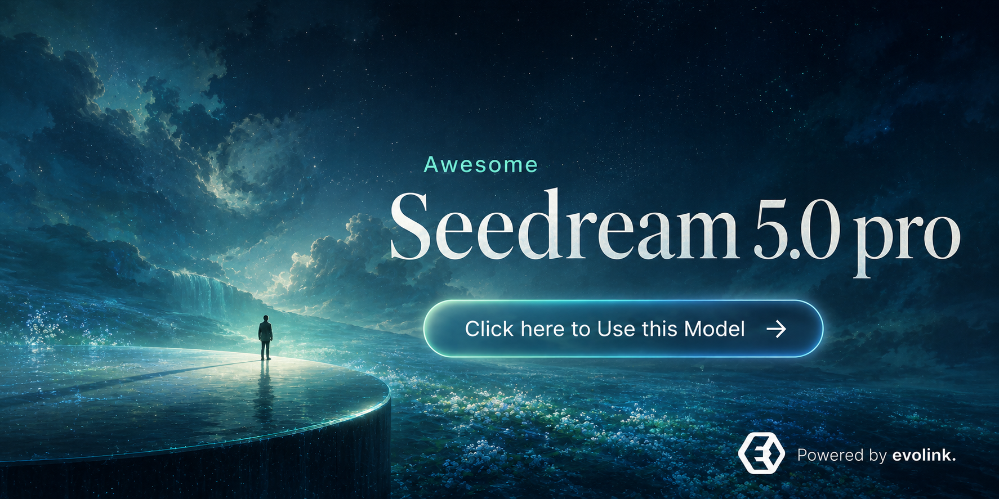
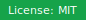
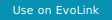
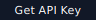
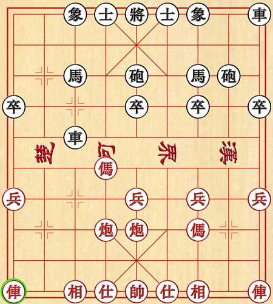
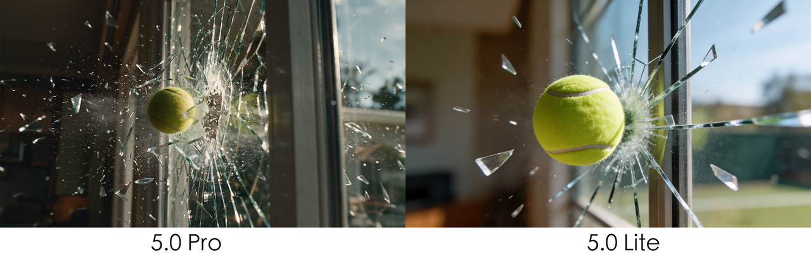
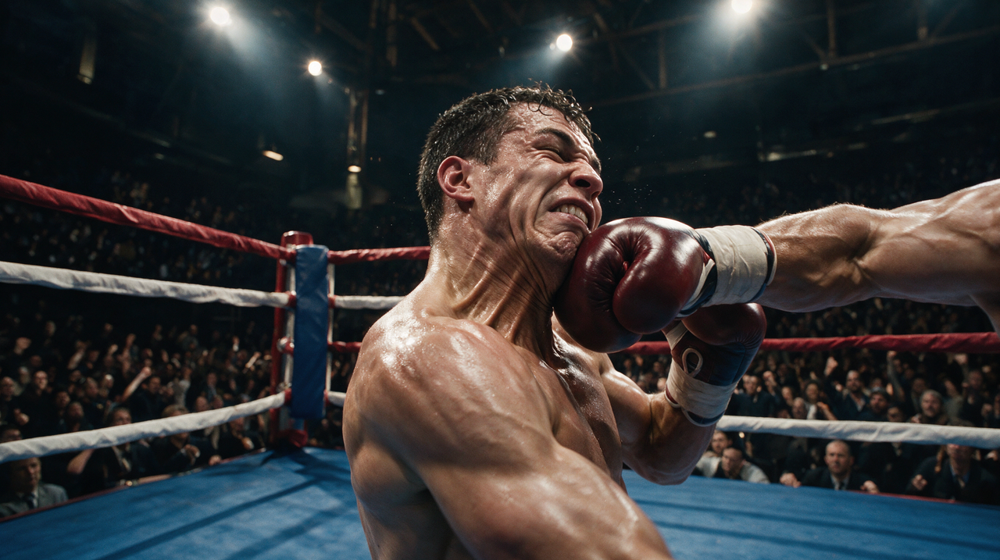

<div align="center">

<a href="https://evolink.ai/seedream-5-0-pro?utm_source=github&utm_medium=banner&utm_campaign=awesome-seedream-5-pro-guide-and-prompt&utm_content=readme_banner"></a>

# Awesome Seedream 5.0 Pro Guide and Prompt

Source-backed guide, prompt patterns, and visual examples for evaluating Seedream 5.0 Pro image generation and editing workflows.

[](LICENSE)
[](https://evolink.ai/seedream-5-0-pro?utm_source=github&utm_medium=badge&utm_campaign=awesome-seedream-5-pro-guide-and-prompt&utm_content=top_badge)
[](https://evolink.ai/dashboard/keys?utm_source=github&utm_medium=quickstart&utm_campaign=awesome-seedream-5-pro-guide-and-prompt&utm_content=api_key)

[🇺🇸 English](README.md) · [🇪🇸 Español](README_es.md) · [🇵🇹 Português](README_pt.md) · [🇯🇵 日本語](README_ja.md) · [🇰🇷 한국어](README_ko.md) · [🇩🇪 Deutsch](README_de.md) · [🇫🇷 Français](README_fr.md) · [🇹🇷 Türkçe](README_tr.md) · [🇹🇼 繁體中文](README_zh-TW.md) · [🇨🇳 简体中文](README_zh-CN.md) · [🇷🇺 Русский](README_ru.md)

</div>

<a id="introduction"></a>

## 🍌 Introduction

Seedream 5.0 Pro is presented in official launch material as an image generation and editing model for controllable visual production. The source material emphasizes region-directed edits, sketch-guided edits, anchor positioning, layer separation, material and color control, multi-reference composition, cinematic imagery, and multilingual text rendering.

This repository is a **guide and prompt** surface. It keeps source-backed prompt patterns and media examples in one place so builders can inspect what to test, copy only the prompts that appear in the source material, and move toward an EvoLink conversion path when access is available.

Try the model entry point on EvoLink: [Open the Seedream 5.0 Pro EvoLink path](https://evolink.ai/seedream-5-0-pro?utm_source=github&utm_medium=readme&utm_campaign=awesome-seedream-5-pro-guide-and-prompt&utm_content=top_text_cta).

**Quick start:** the current repository does not claim that an EvoLink Seedream 5.0 Pro first-run API route has been verified. Use this path as the public conversion route until current-model runtime evidence is recorded:

1. [Open EvoLink for Seedream 5.0 Pro access](https://evolink.ai/seedream-5-0-pro?utm_source=github&utm_medium=quickstart&utm_campaign=awesome-seedream-5-pro-guide-and-prompt&utm_content=model_link).
2. [Get your EvoLink API key](https://evolink.ai/dashboard/keys?utm_source=github&utm_medium=quickstart&utm_campaign=awesome-seedream-5-pro-guide-and-prompt&utm_content=api_key).
3. Treat the official ModelArk reference as technical background: [Read the Seedream 5.0 Pro ModelArk docs](https://docs.byteplus.com/en/docs/ModelArk/1541523).

Runtime status: the official material names `dola-seedream-5-0-pro-260628` as the Seedream 5.0 Pro model ID, but this repository has not completed a credit-consuming EvoLink API smoke test. Do not treat adjacent image-model examples as verified Seedream 5.0 Pro first-run evidence.

<a id="news"></a>

## 📰 News

- **2026-07-08:** Initial local scaffold created from official Seedream 5.0 Pro launch material and media export.

<a id="menu"></a>

## 📑 Menu

- [🍌 Introduction](#introduction)
- [📰 News](#news)
- [📑 Menu](#menu)
- [🎛️ Controlled Editing Prompt Patterns](#controlled-editing-prompt-patterns)
  - [Case 1: Region-box object description for targeted editing](#case-1)
  - [Case 2: Anchor-position edit on a grid-like scene](#case-2)
  - [Case 3: Multi-reference still-life composition](#case-3)
- [🎬 Visual Capability Gallery](#visual-capability-gallery)
- [🧩 Model Notes](#model-notes)
- [🙏 Acknowledge](#acknowledge)

<a id="controlled-editing-prompt-patterns"></a>

## 🎛️ Controlled Editing Prompt Patterns


<a id="case-1"></a>

### Case 1: Region-box object description for targeted editing

<table>
  <tr>
    <td width="50%" valign="top"></td>
    <td width="50%" valign="top"></td>
  </tr>
</table>

**Prompt:**

```
Red box: A huge blue-furred head with a ferocious squished expression, gazing at the bubble ahead. Green box: A transparent bubble reflecting the indoor lights. Yellow box: A large warm gray-beige yarn ball. Blue box: A stack of building blocks including a warm dark gray arch, a warm light gray half-cylinder, a lake blue cylinder, a deep lake blue ramp, and a cobalt blue half-disc. Purple box: A grass green tasseled blanket draped over the sofa.
```

Source: Official.

<a id="case-2"></a>

### Case 2: Anchor-position edit on a grid-like scene

<table>
  <tr>
    <td width="50%" valign="top"><strong>Before</strong><br></td>
    <td width="50%" valign="top"><strong>After</strong><br></td>
  </tr>
</table>

**Prompt:**

```
Move the red car in the lower-left corner one grid cell to the right, and move the black pawn in the second column from the left of the black-square position one grid cell downward.
```

Source: Official.

<a id="case-3"></a>

### Case 3: Multi-reference still-life composition


**Prompt:**

```
Precisely cut out the objects from my seven white-background reference photos and arrange them into a realistic still-life photography image according to the specified layout. Make sure the perspective, lighting, and spatial relationships are correct. Faithfully preserve material details such as wood grain, leather, lace, jelly glass, and feathers, creating a high-quality image that feels realistic and playful, with a blend of vintage and modern aesthetics.
```

Source: Official.

<a id="visual-capability-gallery"></a>

## 🎬 Visual Capability Gallery

The official material includes additional visual samples for sketch-guided editing, layer separation, cinematic narrative imagery, and multilingual text rendering.

<table>
  <tr>
    <td width="50%" valign="top"><strong>Sketch-guided doodles</strong><br></td>
    <td width="50%" valign="top"><strong>Sketch-guided color block</strong><br></td>
  </tr>
  <tr>
    <td width="50%" valign="top"><strong>Sketch-guided lines</strong><br></td>
    <td width="50%" valign="top"><strong>Simple sketch control</strong><br></td>
  </tr>
  <tr>
    <td width="50%" valign="top"><strong>Layer separation example</strong><br></td>
    <td width="50%" valign="top"><strong>Layer separation variant</strong><br></td>
  </tr>
  <tr>
    <td width="50%" valign="top"><strong>Cinematic tennis glass shatter</strong><br></td>
    <td width="50%" valign="top"><strong>Cinematic action boxing</strong><br></td>
  </tr>
  <tr>
    <td width="50%" valign="top"><strong>Arabic and English text rendering</strong><br></td>
    <td width="50%" valign="top"><strong>Korean text rendering</strong><br></td>
  </tr>
</table>

<a id="model-notes"></a>

## 🧩 Model Notes

| Area | Source-backed note |
|---|---|
| Model ID | Official material lists `dola-seedream-5-0-pro-260628`; EvoLink runtime verification is still required before this becomes first-run evidence. |
| Input images | Source material says Seedream 5.0 Pro supports up to 10 input images. |
| Output resolution | Source material says the public positioning should not claim 4K for Pro; it describes output tiers around <= 2.36M pixels and > 2.36M pixels. |
| Native prompt languages | Source material lists Arabic, English, Russian, Indonesian, Spanish, German, Turkish, Portuguese, Malay, Vietnamese, French, Japanese, Korean, Tagalog, and Thai. |
| Seedream to Seedance path | Source material says Seedream 5.0 Pro/Lite outputs can become trusted inputs for Seedance-family image-to-video workflows, with account and moderation conditions. |

<a id="acknowledge"></a>

## 🙏 Acknowledge

This repository was created from official Seedream 5.0 Pro launch material exported on 2026-07-08.

- Private source URL: recorded in local audit evidence, not exposed as a public README link.
- Runtime note: a credit-consuming EvoLink API smoke test has not been run in this repository audit.
