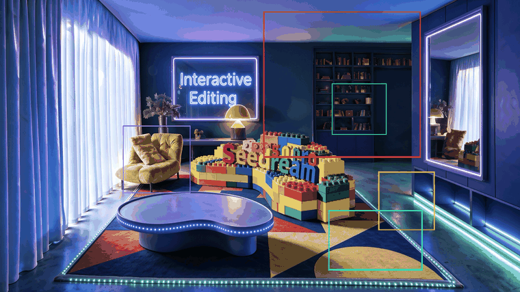
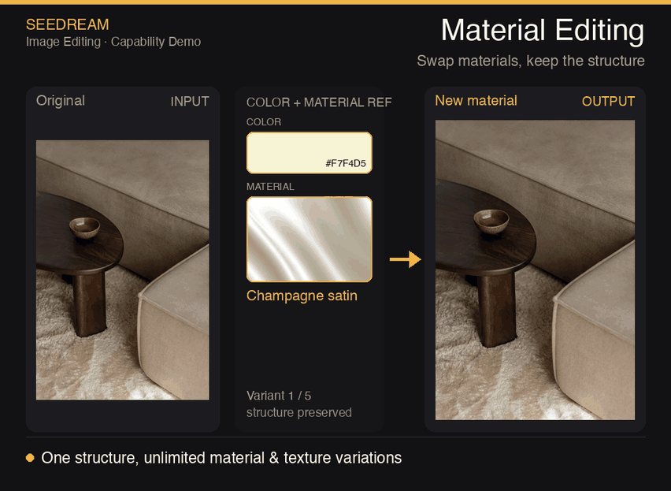
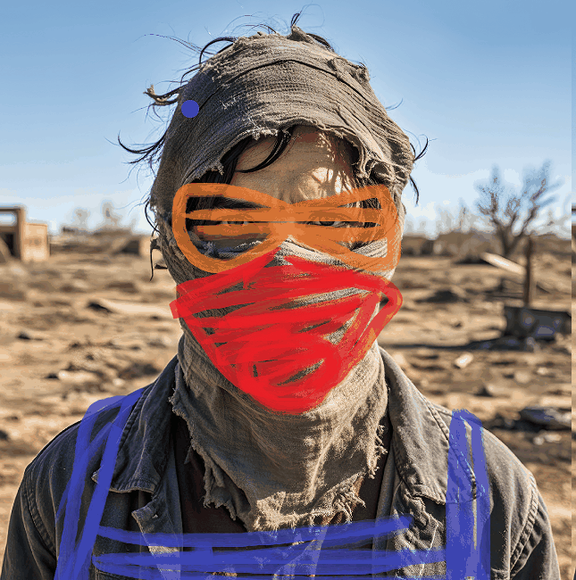
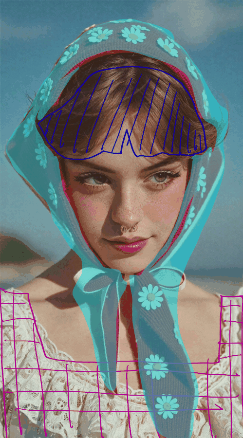
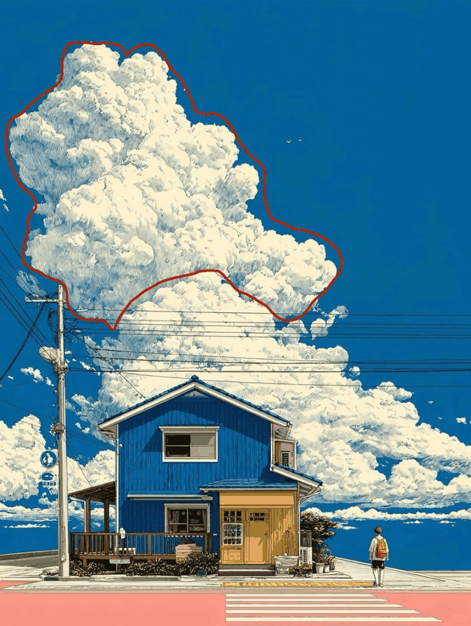
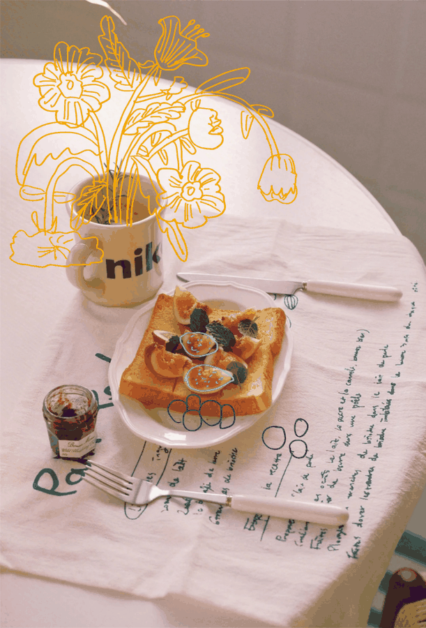

<div align="center">

<a href="https://evolink.ai/seedream-5-0-pro?utm_source=github&utm_medium=banner&utm_campaign=awesome-seedream-5-pro-guide-and-prompt&utm_content=readme_banner"></a>

# Awesome Seedream 5.0 Pro Guide and Prompt

Guía con fuentes, patrones de prompts y ejemplos visuales para evaluar flujos de generación y edición de imágenes con Seedream 5.0 Pro.

[](LICENSE)
[](https://evolink.ai/seedream-5-0-pro?utm_source=github&utm_medium=badge&utm_campaign=awesome-seedream-5-pro-guide-and-prompt&utm_content=top_badge)
[](https://evolink.ai/dashboard/keys?utm_source=github&utm_medium=quickstart&utm_campaign=awesome-seedream-5-pro-guide-and-prompt&utm_content=api_key)

[🇺🇸 English](README.md) · [🇪🇸 Español](README_es.md) · [🇵🇹 Português](README_pt.md) · [🇯🇵 日本語](README_ja.md) · [🇰🇷 한국어](README_ko.md) · [🇩🇪 Deutsch](README_de.md) · [🇫🇷 Français](README_fr.md) · [🇹🇷 Türkçe](README_tr.md) · [🇹🇼 繁體中文](README_zh-TW.md) · [🇨🇳 简体中文](README_zh-CN.md) · [🇷🇺 Русский](README_ru.md)

</div>

<a id="introduction"></a>

## 🍌 Introducción

Seedream 5.0 Pro aparece en el material oficial de lanzamiento como un modelo de generación y edición de imágenes para producción visual controlable. El material destaca ediciones dirigidas por regiones, bocetos, posicionamiento con anclas, separación por capas, control de materiales y color, composición con múltiples referencias, imágenes cinematográficas y texto multilingüe.

Este repositorio es una superficie de **guía y prompts**. Reúne patrones de prompts y ejemplos multimedia respaldados por fuentes para que los builders puedan inspeccionar qué probar, copiar solo los prompts que aparecen en el material fuente y avanzar hacia una ruta de conversión en EvoLink cuando el acceso esté disponible.

Prueba el punto de entrada del modelo en EvoLink: [Abrir la ruta de Seedream 5.0 Pro en EvoLink](https://evolink.ai/seedream-5-0-pro?utm_source=github&utm_medium=readme&utm_campaign=awesome-seedream-5-pro-guide-and-prompt&utm_content=top_text_cta).

**Inicio rápido:** este repositorio no afirma que se haya verificado una ruta API de primera ejecución de EvoLink para Seedream 5.0 Pro. Usa esta ruta pública hasta que se registre evidencia de ejecución del modelo actual:

1. [Abrir EvoLink para acceder a Seedream 5.0 Pro](https://evolink.ai/seedream-5-0-pro?utm_source=github&utm_medium=quickstart&utm_campaign=awesome-seedream-5-pro-guide-and-prompt&utm_content=model_link).
2. [Obtener tu clave API de EvoLink](https://evolink.ai/dashboard/keys?utm_source=github&utm_medium=quickstart&utm_campaign=awesome-seedream-5-pro-guide-and-prompt&utm_content=api_key).
3. Tratar la referencia oficial de ModelArk como contexto técnico: [Leer la documentación de Seedream 5.0 Pro en ModelArk](https://docs.byteplus.com/en/docs/ModelArk/1541523).

Estado de ejecución: el material oficial nombra `dola-seedream-5-0-pro-260628` como ID del modelo Seedream 5.0 Pro, pero este repositorio no ha completado una prueba de API de EvoLink que consuma créditos. No trates ejemplos de modelos de imagen adyacentes como evidencia verificada de primera ejecución para Seedream 5.0 Pro.

<a id="news"></a>

## 📰 Novedades

- **2026-07-08:** Scaffold local inicial creado a partir del material oficial de lanzamiento de Seedream 5.0 Pro y la exportación multimedia.

<a id="menu"></a>

## 📑 Menú

- [🍌 Introducción](#introduction)
- [📰 Novedades](#news)
- [📑 Menú](#menu)
- [🎛️ Patrones de prompts para edición controlada](#controlled-editing-prompt-patterns)
  - [Case 1: Descripción de objetos por cajas de región para edición dirigida](#case-1)
  - [Case 2: Edición por posición de anclas en una escena tipo cuadrícula](#case-2)
  - [Case 3: Composición de bodegón con múltiples referencias](#case-3)
- [🎬 Galería visual de capacidades](#visual-capability-gallery)
- [🧩 Notas del modelo](#model-notes)
- [🙏 Agradecimientos](#acknowledge)

<a id="controlled-editing-prompt-patterns"></a>

## 🎛️ Patrones de prompts para edición controlada

Los casos siguientes no son ejemplos inventados. Se copiaron o tradujeron del material fuente oficial de Seedream 5.0 Pro resumido en `docs/source-notes.md`.

<a id="case-1"></a>

### Case 1: [Descripción de objetos por cajas de región para edición dirigida](docs/source-notes.md#included-public-cases) (by [@官方](docs/source-notes.md))



**Prompt:**

```
Red box: A huge blue-furred head with a ferocious squished expression, gazing at the bubble ahead. Green box: A transparent bubble reflecting the indoor lights. Yellow box: A large warm gray-beige yarn ball. Blue box: A stack of building blocks including a warm dark gray arch, a warm light gray half-cylinder, a lake blue cylinder, a deep lake blue ramp, and a cobalt blue half-disc. Purple box: A grass green tasseled blanket draped over the sofa.
```

Source: 官方.

<a id="case-2"></a>

### Case 2: [Edición por posición de anclas en una escena tipo cuadrícula](docs/source-notes.md#included-public-cases) (by [@官方](docs/source-notes.md))

<table>
  <tr>
    <td width="50%" valign="top"><strong>Antes</strong><br></td>
    <td width="50%" valign="top"><strong>Después</strong><br></td>
  </tr>
</table>

**Prompt:**

```
Move the red car in the lower-left corner one grid cell to the right, and move the black pawn in the second column from the left of the black-square position one grid cell downward.
```

Source: 官方.

<a id="case-3"></a>

### Case 3: [Composición de bodegón con múltiples referencias](docs/source-notes.md#included-public-cases) (by [@官方](docs/source-notes.md))



**Prompt:**

```
Precisely cut out the objects from my seven white-background reference photos and arrange them into a realistic still-life photography image according to the specified layout. Make sure the perspective, lighting, and spatial relationships are correct. Faithfully preserve material details such as wood grain, leather, lace, jelly glass, and feathers, creating a high-quality image that feels realistic and playful, with a blend of vintage and modern aesthetics.
```

Source: 官方.

<a id="visual-capability-gallery"></a>

## 🎬 Galería visual de capacidades

El material oficial incluye muestras visuales adicionales de edición guiada por bocetos, separación de capas, narrativa cinematográfica y renderizado de texto multilingüe.

<table>
  <tr>
    <td width="50%" valign="top"><strong><a href="docs/source-notes.md#included-public-cases">Garabatos guiados por boceto</a></strong> - by <a href="docs/source-notes.md">@官方</a><br></td>
    <td width="50%" valign="top"><strong><a href="docs/source-notes.md#included-public-cases">Bloque de color guiado por boceto</a></strong> - by <a href="docs/source-notes.md">@官方</a><br></td>
  </tr>
  <tr>
    <td width="50%" valign="top"><strong><a href="docs/source-notes.md#included-public-cases">Líneas guiadas por boceto</a></strong> - by <a href="docs/source-notes.md">@官方</a><br></td>
    <td width="50%" valign="top"><strong><a href="docs/source-notes.md#included-public-cases">Control con boceto simple</a></strong> - by <a href="docs/source-notes.md">@官方</a><br></td>
  </tr>
  <tr>
    <td width="50%" valign="top"><strong><a href="docs/source-notes.md#included-public-cases">Ejemplo de separación de capas</a></strong> - by <a href="docs/source-notes.md">@官方</a><br></td>
    <td width="50%" valign="top"><strong><a href="docs/source-notes.md#included-public-cases">Variante de separación de capas</a></strong> - by <a href="docs/source-notes.md">@官方</a><br></td>
  </tr>
  <tr>
    <td width="50%" valign="top"><strong><a href="docs/source-notes.md#included-public-cases">Tenis cinematográfico con cristal roto</a></strong> - by <a href="docs/source-notes.md">@官方</a><br></td>
    <td width="50%" valign="top"><strong><a href="docs/source-notes.md#included-public-cases">Acción cinematográfica de boxeo</a></strong> - by <a href="docs/source-notes.md">@官方</a><br></td>
  </tr>
  <tr>
    <td width="50%" valign="top"><strong><a href="docs/source-notes.md#included-public-cases">Renderizado de texto árabe e inglés</a></strong> - by <a href="docs/source-notes.md">@官方</a><br></td>
    <td width="50%" valign="top"><strong><a href="docs/source-notes.md#included-public-cases">Renderizado de texto coreano</a></strong> - by <a href="docs/source-notes.md">@官方</a><br></td>
  </tr>
</table>

<a id="model-notes"></a>

## 🧩 Notas del modelo

| Área | Nota respaldada por fuente |
|---|---|
| ID del modelo | El material oficial lista `dola-seedream-5-0-pro-260628`; aún se requiere verificación de ejecución en EvoLink antes de usarlo como evidencia de primera ejecución. |
| Imágenes de entrada | El material fuente dice que Seedream 5.0 Pro admite hasta 10 imágenes de entrada. |
| Resolución de salida | El material fuente dice que el posicionamiento público no debe prometer 4K para Pro; describe niveles de salida alrededor de <= 2.36M píxeles y > 2.36M píxeles. |
| Idiomas nativos de prompt | El material fuente lista árabe, inglés, ruso, indonesio, español, alemán, turco, portugués, malayo, vietnamita, francés, japonés, coreano, tagalo y tailandés. |
| Ruta Seedream a Seedance | El material fuente dice que las salidas de Seedream 5.0 Pro/Lite pueden convertirse en entradas confiables para flujos de imagen a video de la familia Seedance, con condiciones de cuenta y moderación. |

<a id="acknowledge"></a>

## 🙏 Agradecimientos

Este repositorio se creó a partir del material oficial de lanzamiento de Seedream 5.0 Pro exportado el 2026-07-08.

- Nota pública de procedencia: `docs/source-notes.md`
- URL fuente privada: registrada en evidencia local de auditoría, no expuesta como enlace público del README.
- Nota de ejecución: no se ha realizado una prueba de API de EvoLink que consuma créditos en esta auditoría del repositorio.
