<div align="center">

<a href="https://evolink.ai/seedream-5-0-pro?utm_source=github&utm_medium=banner&utm_campaign=awesome-seedream-5-pro-guide-and-prompt&utm_content=readme_banner"></a>

# Guide et prompts Awesome Seedream 5.0 Pro

Guide appuyé par les sources, modèles de prompt et exemples visuels pour évaluer les workflows de génération et d’édition d’images avec Seedream 5.0 Pro.

[](LICENSE)
[](https://evolink.ai/seedream-5-0-pro?utm_source=github&utm_medium=badge&utm_campaign=awesome-seedream-5-pro-guide-and-prompt&utm_content=top_badge)
[](https://evolink.ai/dashboard/keys?utm_source=github&utm_medium=quickstart&utm_campaign=awesome-seedream-5-pro-guide-and-prompt&utm_content=api_key)

[🇺🇸 English](README.md) · [🇪🇸 Español](README_es.md) · [🇵🇹 Português](README_pt.md) · [🇯🇵 日本語](README_ja.md) · [🇰🇷 한국어](README_ko.md) · [🇩🇪 Deutsch](README_de.md) · [🇫🇷 Français](README_fr.md) · [🇹🇷 Türkçe](README_tr.md) · [🇹🇼 繁體中文](README_zh-TW.md) · [🇨🇳 简体中文](README_zh-CN.md) · [🇷🇺 Русский](README_ru.md)

</div>

<a id="introduction"></a>

## 🍌 Présentation

Seedream 5.0 Pro est présenté dans le matériel officiel de lancement comme un modèle contrôlable de génération et d’édition d’images. Ce guide aligne le README public sur le menu officiel des capacités : contrôle d’interaction, édition par croquis, édition de calques, positionnement par ancre, séparation de calques, fusion multi-image, exemples d’effets visuels et rendu de texte multilingue.

**Utilisez ce dépôt pour inspecter des exemples appuyés par la source, copier uniquement les prompts présents dans le matériel officiel et comprendre comment chaque catégorie correspond aux cas visibles.**

Essayez le point d’entrée du modèle sur EvoLink : [ouvrir Seedream 5.0 Pro sur EvoLink](https://evolink.ai/seedream-5-0-pro?utm_source=github&utm_medium=readme&utm_campaign=awesome-seedream-5-pro-guide-and-prompt&utm_content=top_text_cta).

**Démarrage rapide:** Ce dépôt ne prétend pas qu’une route API de première exécution EvoLink pour Seedream 5.0 Pro a été vérifiée. Utilisez l’entrée publique du modèle, le tableau de bord des clés API et la référence technique officielle jusqu’à ce qu’une preuve runtime soit enregistrée.

1. [Ouvrir le parcours Seedream 5.0 Pro sur EvoLink](https://evolink.ai/seedream-5-0-pro?utm_source=github&utm_medium=quickstart&utm_campaign=awesome-seedream-5-pro-guide-and-prompt&utm_content=model_link).
2. [Obtenir votre clé API EvoLink](https://evolink.ai/dashboard/keys?utm_source=github&utm_medium=quickstart&utm_campaign=awesome-seedream-5-pro-guide-and-prompt&utm_content=api_key).
3. [Lire la référence technique officielle ModelArk](https://docs.byteplus.com/en/docs/ModelArk/1541523).

> [!NOTE]
> Politique de source : matériel officiel de lancement. Les URL privées Lark/Feishu restent uniquement dans les preuves locales de vérification et ne sont pas exposées comme pages sources publiques dans le README.

<a id="news"></a>

## 📰 Actualités

- **July 8, 2026:** Guide initial reconstruit autour du menu officiel et de l’inventaire de cas corrigé officiellement.

<a id="menu"></a>

## 📑 Menu

- [🍌 Présentation](#introduction)
- [📰 Actualités](#news)
- [📑 Menu](#menu)
- [🎛️ Contrôle d’interaction](#interaction-control)
  - [Case 1: Flèches et boîtes d’annotation pour l’intention spatiale](#case-1)
  - [Case 2: Description d’objets par zones encadrées pour une édition ciblée](#case-2)
- [✏️ Édition par croquis](#sketch-editing)
  - [Case 3: Génération d’objet guidée par un gribouillage](#case-3)
  - [Case 4: Édition guidée par blocs de couleur](#case-4)
  - [Case 5: Édition de détail guidée par des lignes](#case-5)
  - [Case 6: Du croquis simple à l’image affinée](#case-6)
- [🧱 Édition de calques](#layer-editing)
  - [Case 7: Édition des calques texte et graphique d’un poster : Avery Turns](#case-7)
  - [Case 8: Édition du calque d’offre d’un poster : Happy Hour](#case-8)
  - [Case 9: Édition d’un calque d’image mode dans une mise en page](#case-9)
  - [Case 10: Édition du calque graphique d’un poster sportif](#case-10)
  - [Case 11: Édition d’élément de poster : Public Joy](#case-11)
  - [Case 12: Remplacement de surface matière avec réponse de texture précise](#case-12)
- [📍 Édition par ancre / position](#anchor-position-editing)
  - [Case 13: Déplacement d’objet par position de grille](#case-13)
- [🧩 Séparation de calques](#layer-separation)
  - [Case 14: Séparation du premier plan / de la personne](#case-14)
- [🖼️ Édition par fusion multi-image](#multi-image-fusion-editing)
  - [Case 15: Composition de nature morte entrée/sortie avec sept références](#case-15)
- [🎬 Qualité visuelle et narration](#visual-quality-narrative)
  - [Case 16: Tennis cinématographique avec verre brisé](#case-16)
  - [Case 17: Action de boxe cinématographique](#case-17)
  - [Case 18: Scène en style animation 3D](#case-18)
  - [Case 19: Art conceptuel visuel](#case-19)
  - [Case 20: Visuel de scène de jeu](#case-20)
- [🌐 Rendu de texte multilingue](#multilingual-text-rendering)
  - [Case 21: Panneau de bienvenue en arabe et anglais](#case-21)
  - [Case 22: Panneau coréen ouvert 24 h/24](#case-22)
  - [Case 23: Panneau thaï de propreté](#case-23)
  - [Case 24: Poster français de création](#case-24)
  - [Case 25: Poster russe du futur](#case-25)
- [🧾 Galerie officielle des capacités](#official-capability-gallery)
- [🧪 Cas d’usage de la communauté](#community-use-cases)
  - [Workflows d’édition et de contrôle d’entrée](#community-editing-control)
  - [Design produit, interface et affiche](#community-product-interface-design)
  - [Prompts techniques, diagrammes et séquences](#community-technical-structured-visuals)
  - [Visuels cinéma, personnage et style](#community-cinematic-character-visuals)
  - [Concept art, environnement et worldbuilding](#community-concept-environment-worldbuilding)
  - [Comparaisons et évaluations de modèles](#community-model-comparisons)
- [🧾 Bibliothèque de prompts](#prompt-library)
- [🧩 Notes du modèle](#model-notes)
- [🙏 Remerciements](#acknowledge)

<a id="official-capability-gallery"></a>

## 🧾 Galerie officielle des capacités

La galerie officielle regroupe les exemples de lancement fournis par le propriétaire comme référence de base.

<a id="interaction-control"></a>

## 🎛️ Contrôle d’interaction

Utilisez des boîtes, points, flèches, marques d’annotation ou coordonnées pour spécifier la zone cible.

Nombre de cas : **2**.

<a id="case-1"></a>

### Case 1: Flèches et boîtes d’annotation pour l’intention spatiale


> [!NOTE]
> Utilisez flèches, boîtes et annotations pour rendre la zone cible explicite avant l’édition.

---

<a id="case-2"></a>

### Case 2: Description d’objets par zones encadrées pour une édition ciblée


**Prompt:**

```
Red box: A huge blue-furred head with a ferocious squished expression, gazing at the bubble ahead. Green box: A transparent bubble reflecting the indoor lights. Yellow box: A large warm gray-beige yarn ball. Blue box: A stack of building blocks including a warm dark gray arch, a warm light gray half-cylinder, a lake blue cylinder, a deep lake blue ramp, and a cobalt blue half-disc. Purple box: A grass green tasseled blanket draped over the sofa.
```

---

<a id="sketch-editing"></a>

## ✏️ Édition par croquis

Utilisez des gribouillages, blocs de couleur, lignes ou croquis simples comme guidage visuel.

Nombre de cas : **4**.

<a id="case-3"></a>

### Case 3: Génération d’objet guidée par un gribouillage


> [!NOTE]
> Utilisez des gribouillages libres comme signal de contrôle visuel et laissez le modèle rendre l’objet voulu.

---

<a id="case-4"></a>

### Case 4: Édition guidée par blocs de couleur


> [!NOTE]
> Utilisez de grands blocs de couleur pour préciser la composition générale, les zones de couleur ou le placement des objets.

---

<a id="case-5"></a>

### Case 5: Édition de détail guidée par des lignes


> [!NOTE]
> Utilisez un guidage par lignes simples lorsque la limite de forme compte plus qu’une longue description textuelle.

---

<a id="case-6"></a>

### Case 6: Du croquis simple à l’image affinée


> [!NOTE]
> Transformez un croquis minimal en image rendue plus complète tout en conservant son intention.

---

<a id="layer-editing"></a>

## 🧱 Édition de calques

Modifiez des calques de poster, graphique, texte, matière ou surface tout en préservant la composition globale.

Nombre de cas : **6**.

<a id="case-7"></a>

### Case 7: Édition des calques texte et graphique d’un poster : Avery Turns


> [!NOTE]
> Modifiez les éléments visibles du poster tout en préservant la structure générale du design.

---

<a id="case-8"></a>

### Case 8: Édition du calque d’offre d’un poster : Happy Hour


> [!NOTE]
> Changez un badge promotionnel ou un élément graphique sans reconstruire tout le poster.

---

<a id="case-9"></a>

### Case 9: Édition d’un calque d’image mode dans une mise en page


> [!NOTE]
> Ajustez un sujet en calque dans une mise en page visuelle composée.

---

<a id="case-10"></a>

### Case 10: Édition du calque graphique d’un poster sportif


> [!NOTE]
> Modifiez le graphique d’un poster de course tout en gardant typographie et composition alignées.

---

<a id="case-11"></a>

### Case 11: Édition d’élément de poster : Public Joy


> [!NOTE]
> Modifiez des éléments du poster tout en conservant le langage visuel source.

---

<a id="case-12"></a>

### Case 12: Remplacement de surface matière avec réponse de texture précise


> [!NOTE]
> Remplacez les cibles de matière et de couleur tout en conservant la structure de l’objet.

---

<a id="anchor-position-editing"></a>

## 📍 Édition par ancre / position

Utilisez des ancres de type grille ou des positions relatives pour déplacer précisément une cible donnée.

Nombre de cas : **1**.

<a id="case-13"></a>

### Case 13: Déplacement d’objet par position de grille

<table>
<tr>
<td width="50%" valign="top">

**Avant :**


</td>
<td width="50%" valign="top">

**Après :**


</td>
</tr>
</table>

**Prompt:**

```
Move the red car in the lower-left corner one grid cell to the right, and move the black pawn in the second column from the left of the black-square position one grid cell downward.
```

---

<a id="layer-separation"></a>

## 🧩 Séparation de calques

Séparez le premier plan, l’arrière-plan et les composants réutilisables pour l’édition en aval.

Nombre de cas : **1**.

<a id="case-14"></a>

### Case 14: Séparation du premier plan / de la personne


> [!NOTE]
> Séparez un sujet de premier plan d’un arrière-plan de type poster pour le réutiliser ensuite.

---

<a id="multi-image-fusion-editing"></a>

## 🖼️ Édition par fusion multi-image

Combinez plusieurs images de référence dans une composition cohérente sous une seule instruction.

Nombre de cas : **1**.

<a id="case-15"></a>

### Case 15: Composition de nature morte entrée/sortie avec sept références

<table>
<tr>
<td width="50%" valign="top">

**Entrée :**


</td>
<td width="50%" valign="top">

**Sortie :**


</td>
</tr>
</table>

> [!NOTE]
> Utilisez les sept références sur fond blanc comme groupe d’entrée et générez la sortie de photographie de nature morte dans un seul case apparié.


**Prompt:**

```
Precisely cut out the objects from my seven white-background reference photos and arrange them into a realistic still-life photography image according to the specified layout. Make sure the perspective, lighting, and spatial relationships are correct. Faithfully preserve material details such as wood grain, leather, lace, jelly glass, and feathers, creating a high-quality image that feels realistic and playful, with a blend of vintage and modern aesthetics.
```

---

<a id="visual-quality-narrative"></a>

## 🎬 Qualité visuelle et narration

Regroupez les exemples d’effets par action cinématographique, 3D / animation, art conceptuel et sortie de scène de jeu.

Nombre de cas : **5**.

<a id="case-16"></a>

### Case 16: Tennis cinématographique avec verre brisé


> [!NOTE]
> Génération de scène très dynamique avec éclats de verre, timing d’action et éclairage cinématographique.

---

<a id="case-17"></a>

### Case 17: Action de boxe cinématographique


> [!NOTE]
> Rendu de scène d’action avec une sensation plus forte de mouvement, d’impact et de profondeur.

---

<a id="case-18"></a>

### Case 18: Scène en style animation 3D


> [!NOTE]
> Sortie 3D / animation stylisée pour personnages ou visuels de divertissement.

---

<a id="case-19"></a>

### Case 19: Art conceptuel visuel


> [!NOTE]
> Génération en style art conceptuel pour explorer l’atmosphère, la direction visuelle et l’humeur.

---

<a id="case-20"></a>

### Case 20: Visuel de scène de jeu


> [!NOTE]
> Génération de scène de type jeu pour explorer environnement, décor ou key art.

---

<a id="multilingual-text-rendering"></a>

## 🌐 Rendu de texte multilingue

Regroupez les exemples multilingues par langue rendue et cas d’usage de texte local.

Nombre de cas : **5**.

<a id="case-21"></a>

### Case 21: Panneau de bienvenue en arabe et anglais


> [!NOTE]
> Rendu multilingue natif avec texte arabe et anglais dans le même visuel.

---

<a id="case-22"></a>

### Case 22: Panneau coréen ouvert 24 h/24


> [!NOTE]
> Rendu de texte coréen pour vitrines ou signalétique localisées.

---

<a id="case-23"></a>

### Case 23: Panneau thaï de propreté


> [!NOTE]
> Rendu de texte thaï pour espaces publics locaux ou visuels de campagne.

---

<a id="case-24"></a>

### Case 24: Poster français de création


> [!NOTE]
> Rendu de texte français pour assets de produit, mode et campagne.

---

<a id="case-25"></a>

### Case 25: Poster russe du futur


> [!NOTE]
> Rendu de texte russe avec structure de caractères claire pour concepts visuels localisés.

---

<a id="community-use-cases"></a>

## 🧪 Cas d’usage de la communauté

Ces 35 cas de la communauté sont regroupés par tâche utilisateur et objectif de sortie. Les tags indiquent les attributs secondaires comme comparaison de modèles, prompt disponible, entrée image et sortie multi-image.

Nombre de cas d’usage: **35**.

<a id="community-editing-control"></a>

### Workflows d’édition et de contrôle d’entrée

Nombre de cas d’usage: **3**.

<a id="community-usecase-1"></a>

### Community Use Case 1: [Japanese no-makeup image edit instruction](https://x.com/renataro9/status/2075059699112652908) (by [@renataro9](https://x.com/renataro9))

Type: Tutorial | Date: 2026-07-09 | Category: Editing & Input-Control Workflows

Tags: `image-input` `multi-image` `prompt-available` `tutorial`

<table><tr>
<td width="25%" valign="top">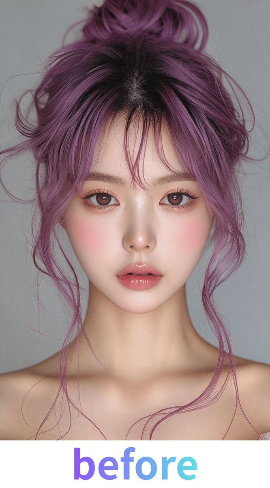</td>
<td width="25%" valign="top">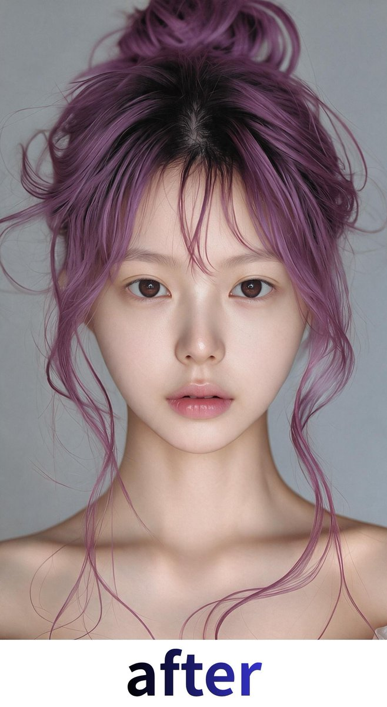</td>
</tr></table>

> [!NOTE]
> The source post demonstrates an image-editing or input-control workflow where the input relationship matters as much as the final image.

<details>
<summary>Extrait de prompt/entrée</summary>

```text
すっぴんメイクにして
```

</details>

---
<a id="community-usecase-2"></a>

### Community Use Case 2: [Localized anime edit preserving composition while changing one subject](https://x.com/haruuraeadss/status/2075035201391255593) (by [@haruuraeadss](https://x.com/haruuraeadss))

Type: Tutorial | Date: 2026-07-09 | Category: Editing & Input-Control Workflows

Tags: `multi-image` `prompt-available` `tutorial`

<table><tr>
<td width="25%" valign="top">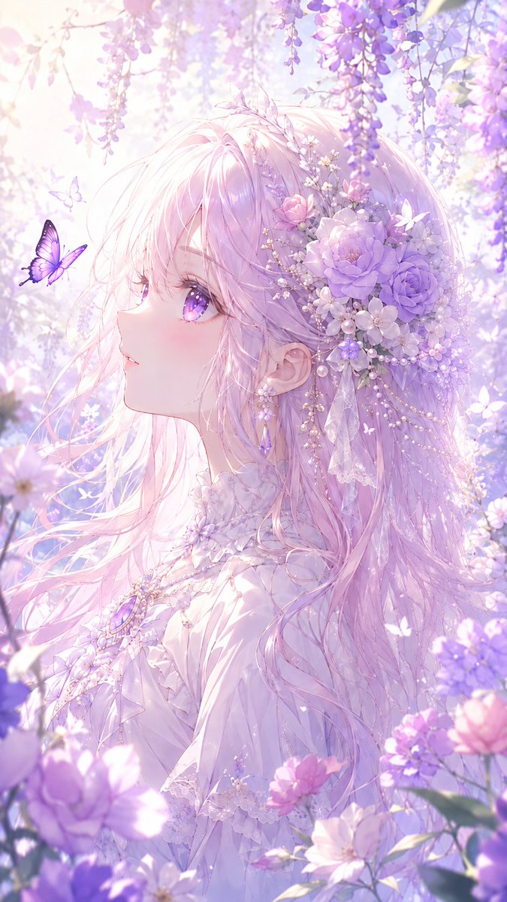</td>
<td width="25%" valign="top">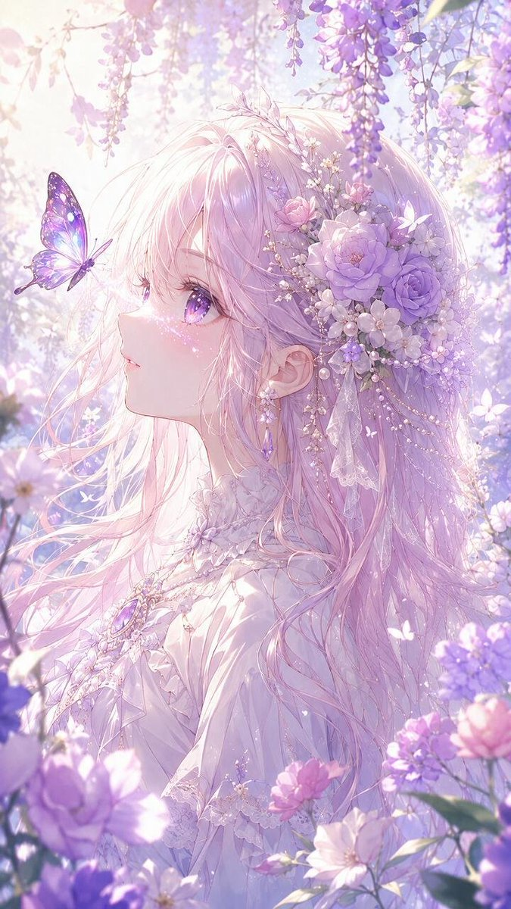</td>
</tr></table>

> [!NOTE]
> The source post demonstrates an image-editing or input-control workflow where the input relationship matters as much as the final image.

<details>
<summary>Extrait de prompt/entrée</summary>

```text
元画像の構図、人物の横顔、顔の輪郭、髪型、花飾り、白いドレス、藤の花の背景、全体の淡いピンクとラベンダーの幻想的な雰囲気はそのまま維持してください。 局所的に、少女の視線の先にいる紫の蝶を、より美しく印象的な「光をまとった宝石のような蝶」に変更してください。蝶の羽は透明感のある紫、水晶、ラベンダー、淡いピンクのグラデーションで、細かな発光粒子と繊細な羽脈を持たせてください。 蝶から少女の瞳へ向かって、細い光の粒子と柔らかな魔法の軌跡を追加してください。光は強すぎず、白飛びさせず、既存の明るく儚い花園の空気感に自然に溶け込ませてください。 少女の紫色の瞳には、蝶の光が小さく反射しているような宝石風のハイライトを少しだけ追加してください。瞳の形、顔立ち、表情、年齢感は変えないでください。 前髪の一部にも、蝶の淡い紫光がわずかに反射しているようにしてください。ただし髪色全体は変えず、ピンクブロンドの柔らかさを維持してください。 全体は高品質な日本アニメイラスト、幻想的、透明感、春の花園、上品、繊細、儚い美しさ。過度な発光、派手な魔法陣、強いコントラスト、顔の変形、衣装変更、背景変更は避けて…
```

</details>

---
<a id="community-usecase-3"></a>

### Community Use Case 3: [Image-input cat-to-mecha transformation](https://x.com/JennyAITech/status/2074870477651398972) (by [@JennyAITech](https://x.com/JennyAITech))

Type: Demo | Date: 2026-07-08 | Category: Editing & Input-Control Workflows

Tags: `image-input` `multi-image` `prompt-available`

<table><tr>
<td width="25%" valign="top">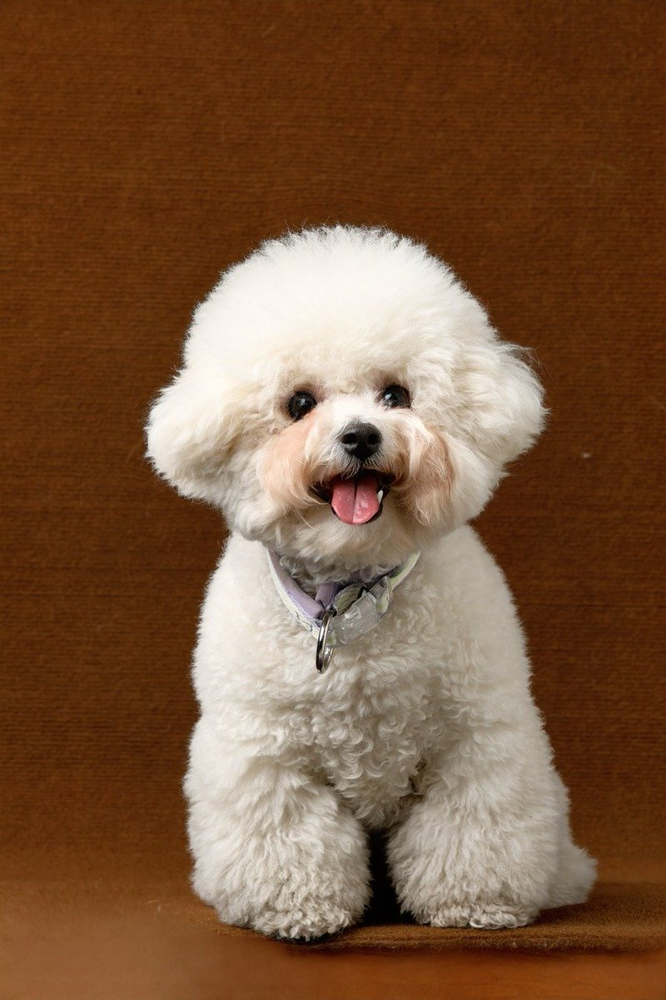</td>
<td width="25%" valign="top">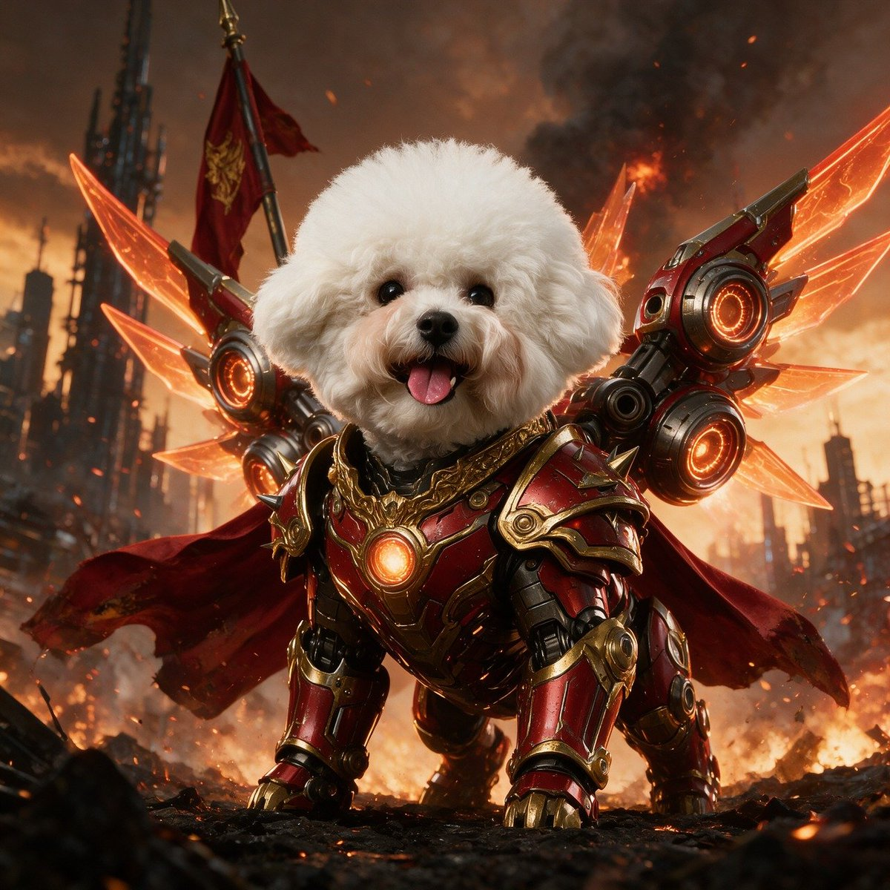</td>
</tr></table>

> [!NOTE]
> The source post demonstrates an image-editing or input-control workflow where the input relationship matters as much as the final image.

<details>
<summary>Extrait de prompt/entrée</summary>

```text
a pic of my cat, asked for a mecha version
```

</details>

---
<a id="community-product-interface-design"></a>

### Design produit, interface et affiche

Nombre de cas d’usage: **4**.

<a id="community-usecase-4"></a>

### Community Use Case 4: [Trading terminal interface with market microstructure detail](https://x.com/MishikaAI/status/2074879603446026333) (by [@MishikaAI](https://x.com/MishikaAI))

Type: Demo | Date: 2026-07-08 | Category: Product, Interface & Poster Design

Tags: `prompt-available`


> [!NOTE]
> The source post tests whether Seedream can produce a usable commercial visual, interface, product ad, or poster-style output.

<details>
<summary>Extrait de prompt/entrée</summary>

```text
a full trading terminal — K-lines, order book, bid/ask, volume, timestamps
```

</details>

---
<a id="community-usecase-5"></a>

### Community Use Case 5: [Cyberpunk android graphic poster](https://x.com/ComfyUI/status/2075027793491226677) (by [@ComfyUI](https://x.com/ComfyUI))

Type: Demo | Date: 2026-07-09 | Category: Product, Interface & Poster Design

Tags: `prompt-available`


> [!NOTE]
> The source post tests whether Seedream can produce a usable commercial visual, interface, product ad, or poster-style output.

<details>
<summary>Extrait de prompt/entrée</summary>

```text
A sci-fi cyberpunk graphic design poster. In the center, a striking portrait of a female android with glossy, liquid chrome skin. A vivid swirling streak of neon orange, yellow, and pink liquid paint brush stroke horizontally covers her eyes, soft smudged color overlay with smooth flowing pigment texture, no cracks or broken facial surfaces. The background is a dark, textured charcoal gray. Behind the central figure, large bold white futuristic typography reads "Seedream 5.0 Pro" with a subtle…
```

</details>

---
<a id="community-usecase-6"></a>

### Community Use Case 6: [Premium sports footwear commercial ad set](https://x.com/iamrealsnow/status/2075063569486598281) (by [@iamrealsnow](https://x.com/iamrealsnow))

Type: Demo | Date: 2026-07-09 | Category: Product, Interface & Poster Design

Tags: `multi-image` `prompt-available`

<table><tr>
<td width="25%" valign="top">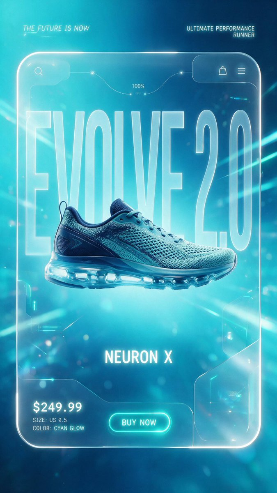</td>
<td width="25%" valign="top">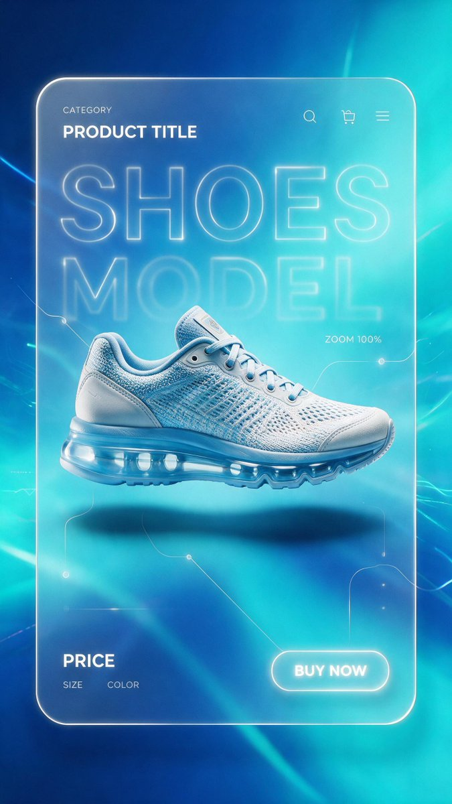</td>
<td width="25%" valign="top"></td>
<td width="25%" valign="top">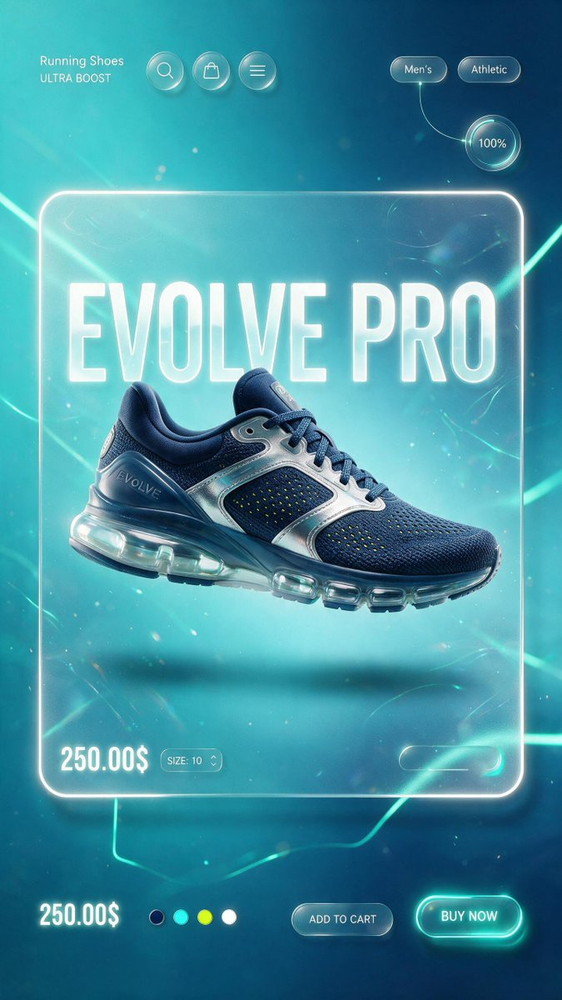</td>
</tr></table>

> [!NOTE]
> The source post tests whether Seedream can produce a usable commercial visual, interface, product ad, or poster-style output.

<details>
<summary>Extrait de prompt/entrée</summary>

```text
Ultra-realistic premium sports footwear commercial advertisement featuring a modern running shoe floating horizontally at the center of a futuristic cyan and deep blue gradient background. The sneaker is displayed in a clean side profile with ultra-detailed breathable knit mesh texture, glossy air-cushion sole, realistic stitching, premium materials, and crisp branding. Soft cinematic studio lighting creates realistic reflections, shadows, and depth. The composition is designed as a futuristic…
```

</details>

---
<a id="community-usecase-7"></a>

### Community Use Case 7: [Kids clay craft advertisement poster](https://x.com/Strength04_X/status/2075063250656621054) (by [@Strength04_X](https://x.com/Strength04_X))

Type: Demo | Date: 2026-07-09 | Category: Product, Interface & Poster Design

Tags: `prompt-available`

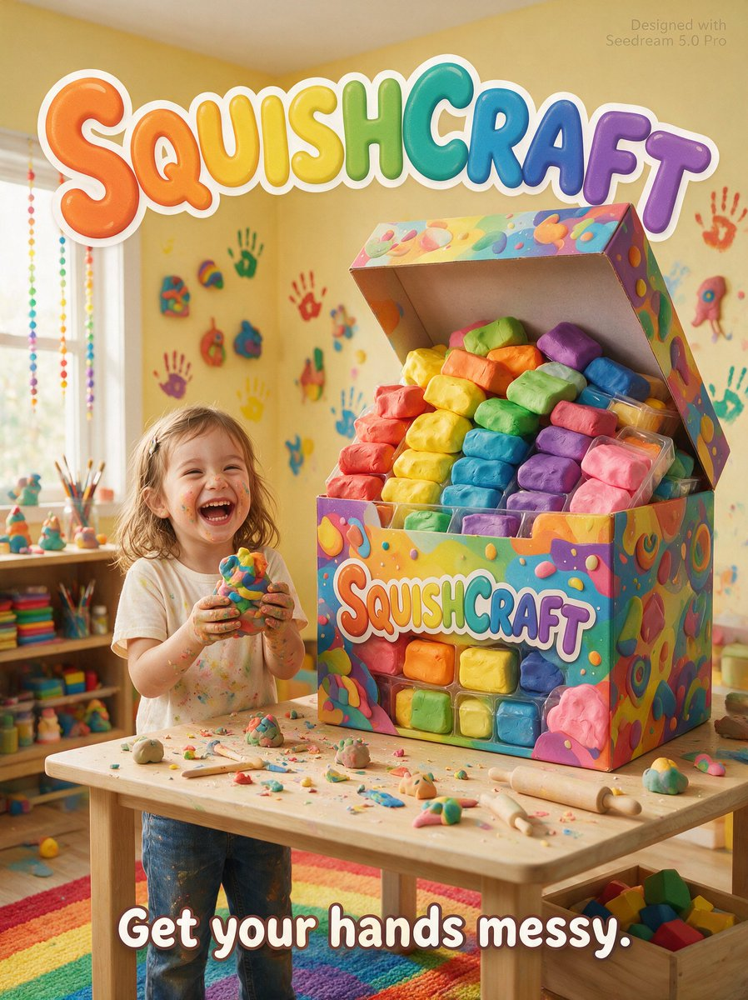

> [!NOTE]
> The source post tests whether Seedream can produce a usable commercial visual, interface, product ad, or poster-style output.

<details>
<summary>Extrait de prompt/entrée</summary>

```text
A messy fun kids advertisement poster. A laughing young girl age 6 with clay all over her hands proudly shows a lumpy clay sculpture beside a giant colorful clay set box 3x her height overflowing with clay blocks in every color, "SQUISHCRAFT" written in big squishy letters on the box. Bright cheerful craft room background with clay sculptures tools and colorful handprints on the walls. Big squishy rounded typography "SQUISHCRAFT" in rainbow colors filling the background. Tagline bottom: "Get yo…
```

</details>

---
<a id="community-technical-structured-visuals"></a>

### Prompts techniques, diagrammes et séquences

Nombre de cas d’usage: **4**.

<a id="community-usecase-8"></a>

### Community Use Case 8: [Measurement-heavy technical blueprint rendering](https://x.com/LiamEtherson/status/2074862867442962667) (by [@LiamEtherson](https://x.com/LiamEtherson))

Type: Demo | Date: 2026-07-08 | Category: Technical, Diagram & Sequence Prompts

Tags: `prompt-available`


> [!NOTE]
> The source post tests cinematic, character, fashion, style, structured, or worldbuilding visual quality with visible media output.

<details>
<summary>Extrait de prompt/entrée</summary>

```text
technical blueprint with abundant measurement values
```

</details>

---
<a id="community-usecase-9"></a>

### Community Use Case 9: [Concept car blueprint with exploded technical views](https://x.com/AiwithZohaib/status/2074880584107909602) (by [@AiwithZohaib](https://x.com/AiwithZohaib))

Type: Demo | Date: 2026-07-08 | Category: Technical, Diagram & Sequence Prompts

Tags: `prompt-available`

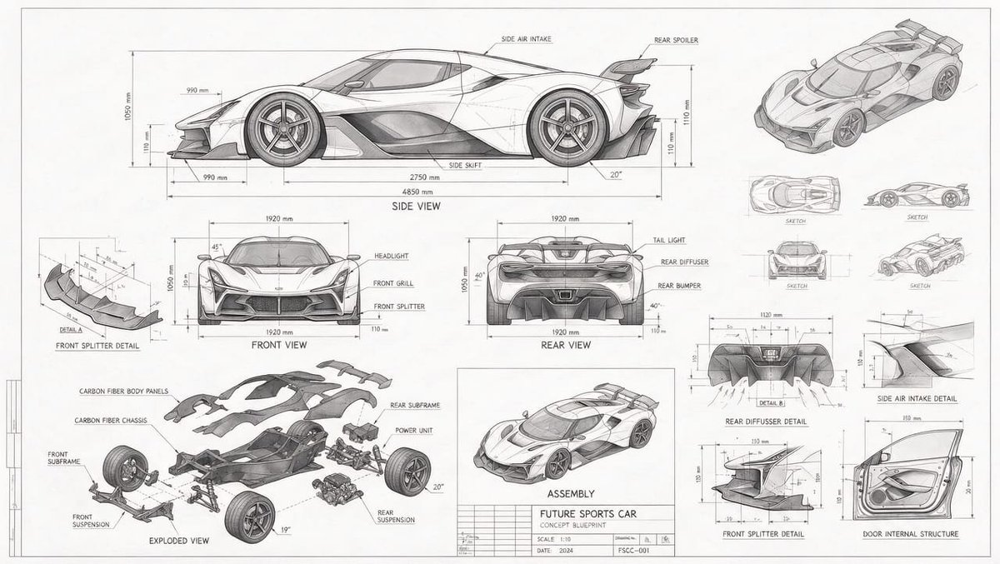

> [!NOTE]
> The source post tests cinematic, character, fashion, style, structured, or worldbuilding visual quality with visible media output.

<details>
<summary>Extrait de prompt/entrée</summary>

```text
a blueprint-style technical drawing of a concept car: front/side/rear views, exploded parts, measurements everywhere
```

</details>

---
<a id="community-usecase-10"></a>

### Community Use Case 10: [Shot-list driven grayscale scene planning](https://x.com/munzxsdv/status/2074865454485483885) (by [@munzxsdv](https://x.com/munzxsdv))

Type: Demo | Date: 2026-07-08 | Category: Technical, Diagram & Sequence Prompts

Tags: `prompt-available`

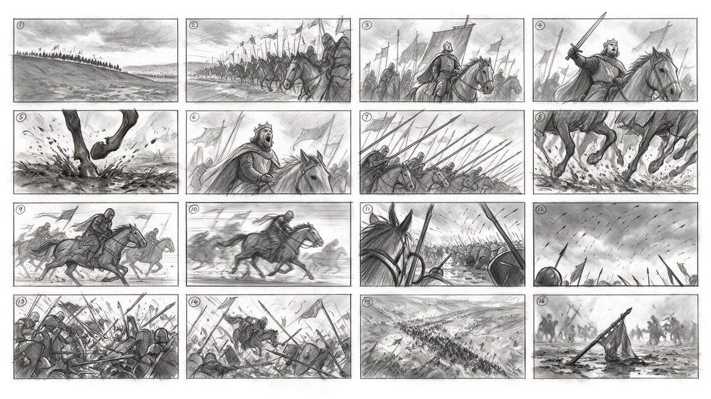

> [!NOTE]
> The source post tests cinematic, character, fashion, style, structured, or worldbuilding visual quality with visible media output.

<details>
<summary>Extrait de prompt/entrée</summary>

```text
a shot list — panel-by-panel direction, camera moves, grayscale spec
```

</details>

---
<a id="community-usecase-11"></a>

### Community Use Case 11: [Single-prompt 16-panel cavalry storyboard](https://x.com/sulekhat95/status/2074966196563431636) (by [@sulekhat95](https://x.com/sulekhat95))

Type: Demo | Date: 2026-07-08 | Category: Technical, Diagram & Sequence Prompts

Tags: `prompt-available`

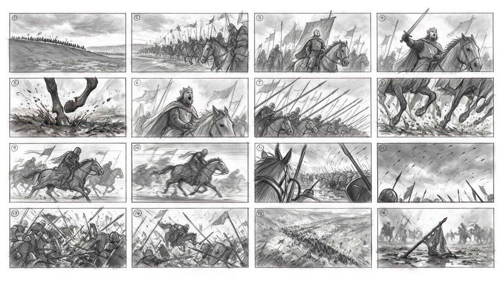

> [!NOTE]
> The source post tests cinematic, character, fashion, style, structured, or worldbuilding visual quality with visible media output.

<details>
<summary>Extrait de prompt/entrée</summary>

```text
16-panel storyboard from ONE prompt: numbered frames, consistent characters, coherent camera logic across a whole cavalry charge
```

</details>

---
<a id="community-cinematic-character-visuals"></a>

### Visuels cinéma, personnage et style

Nombre de cas d’usage: **10**.

<a id="community-usecase-12"></a>

### Community Use Case 12: [Fisheye editorial portraits with miniature clone motif](https://x.com/magnific/status/2074872903938846900) (by [@magnific](https://x.com/magnific))

Type: Demo | Date: 2026-07-08 | Category: Cinematic, Character & Style Visuals

Tags: `multi-image` `prompt-available`

<table><tr>
<td width="25%" valign="top">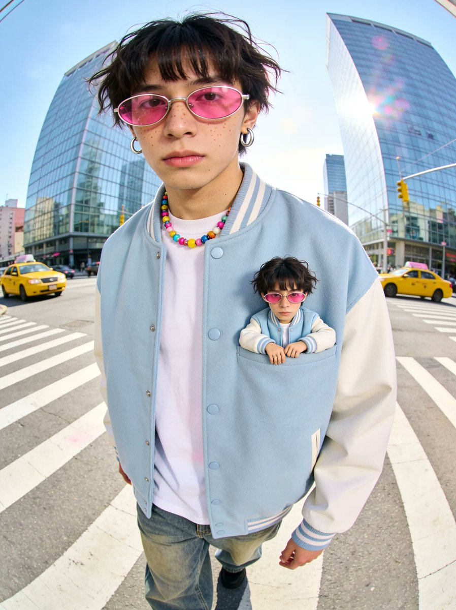</td>
<td width="25%" valign="top">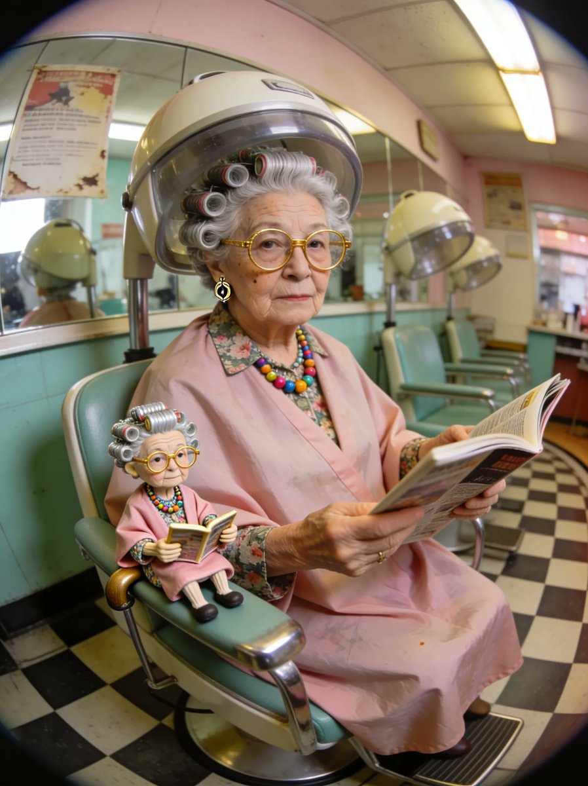</td>
</tr></table>

> [!NOTE]
> The source post tests cinematic, character, fashion, style, structured, or worldbuilding visual quality with visible media output.

<details>
<summary>Extrait de prompt/entrée</summary>

```text
Shot on cinema camera with subtle halation effect, 35mm film grain, fashion editorial photography in the style of Y2K revival magazine covers. Extreme fisheye lens, distorted wide perspective pulling the scene toward the curved edges, low camera angle from the street. A young man around 20 years old with messy dark hair with soft curtain bangs, smooth youthful skin with natural texture and a few freckles, wearing small oval sunglasses with pink tinted lenses, a colorful beaded necklace, silver…
```

</details>

---
<a id="community-usecase-13"></a>

### Community Use Case 13: [Melting-world-landmarks concept generation](https://x.com/magnific/status/2074918700709523881) (by [@magnific](https://x.com/magnific))

Type: Demo | Date: 2026-07-08 | Category: Cinematic, Character & Style Visuals

Tags: `multi-image` `prompt-available`

<table><tr>
<td width="25%" valign="top">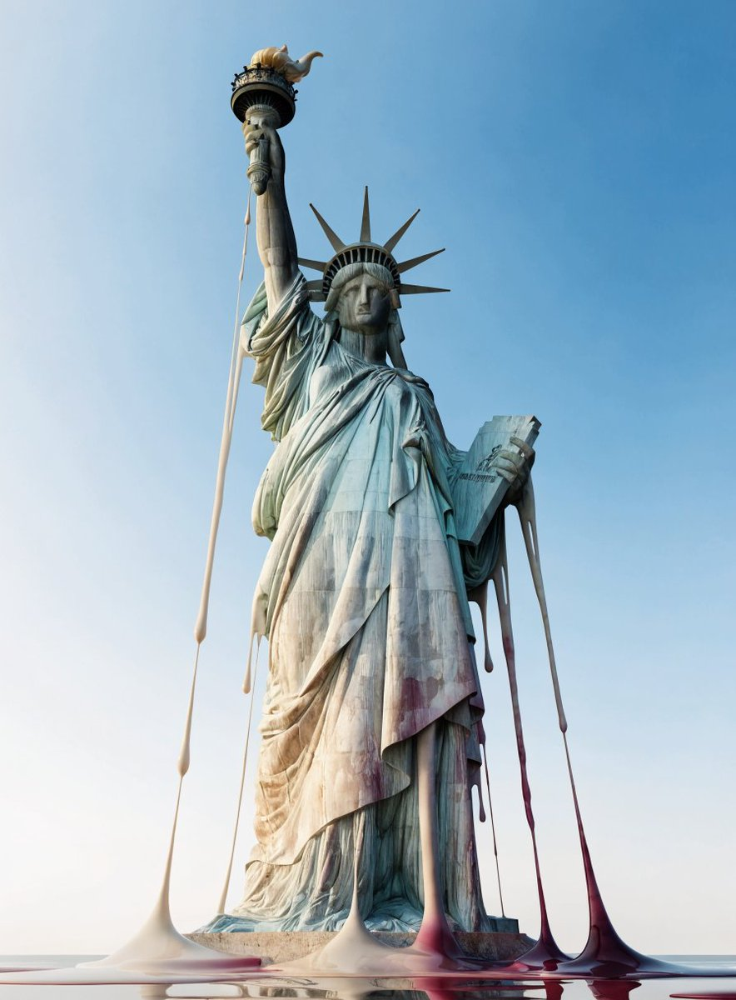</td>
<td width="25%" valign="top">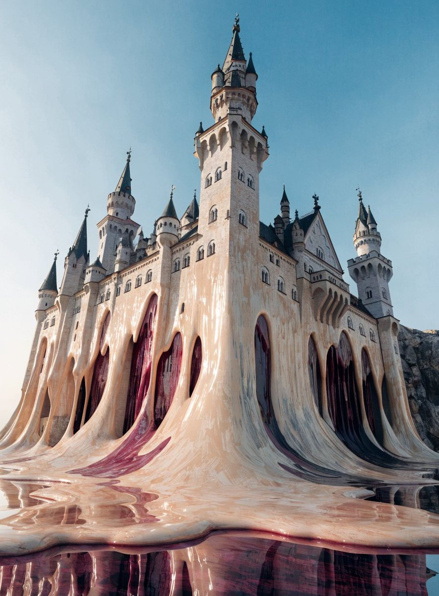</td>
</tr></table>

> [!NOTE]
> The source post tests cinematic, character, fashion, style, structured, or worldbuilding visual quality with visible media output.

<details>
<summary>Extrait de prompt/entrée</summary>

```text
world's landmarks, melting like wax
```

</details>

---
<a id="community-usecase-14"></a>

### Community Use Case 14: [Photorealistic high-fashion portrait lighting](https://x.com/BubbleBrain/status/2074856963591290979) (by [@BubbleBrain](https://x.com/BubbleBrain))

Type: Demo | Date: 2026-07-08 | Category: Cinematic, Character & Style Visuals

Tags: `prompt-available`

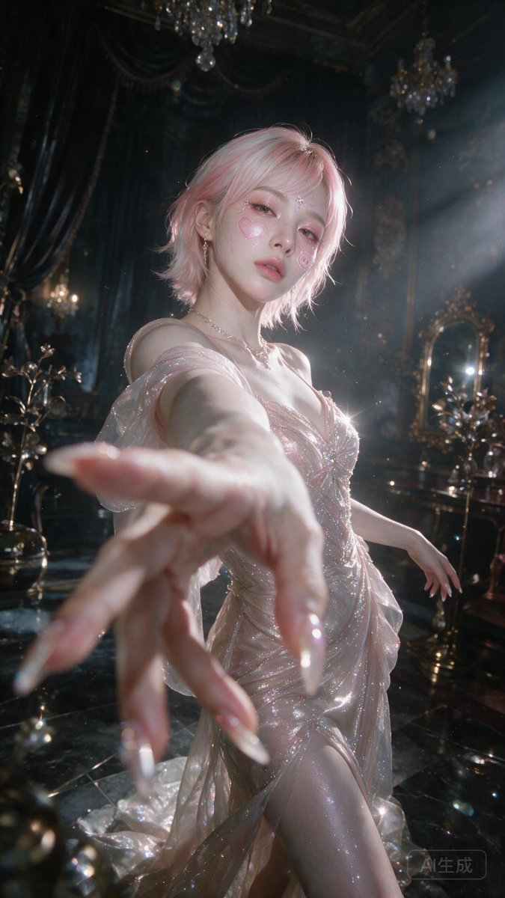

> [!NOTE]
> The source post tests cinematic, character, fashion, style, structured, or worldbuilding visual quality with visible media output.

<details>
<summary>Extrait de prompt/entrée</summary>

```text
This is a highly photorealistic, high-fashion full-body portrait with an overall dark-toned, dreamy, and hazy atmosphere, filled with the flowing beauty of light and shadow. The scene uses refined artificial lighting that is soft yet richly layered, with sparkling highlights, crystal-clear reflections, and a subtle lomo film texture in certain areas, creating a surreal and luxurious fashion mood that feels both realistic and dreamlike. The subject is a young adult Taiwanese woman with short pin…
```

</details>

---
<a id="community-usecase-15"></a>

### Community Use Case 15: [Natural phone-photo scene at San Francisco sunset](https://x.com/mattworkman/status/2074850550349222210) (by [@mattworkman](https://x.com/mattworkman))

Type: Demo | Date: 2026-07-08 | Category: Cinematic, Character & Style Visuals

Tags: `prompt-available`


> [!NOTE]
> The source post tests cinematic, character, fashion, style, structured, or worldbuilding visual quality with visible media output.

<details>
<summary>Extrait de prompt/entrée</summary>

```text
a Korean girl in her twenties on her iPhone in San Francisco at sunset
```

</details>

---
<a id="community-usecase-16"></a>

### Community Use Case 16: [Fantasy fallen-angel warrior key visual](https://x.com/SimplyAnnisa/status/2074900816662774189) (by [@SimplyAnnisa](https://x.com/SimplyAnnisa))

Type: Demo | Date: 2026-07-08 | Category: Cinematic, Character & Style Visuals

Tags: `prompt-available`

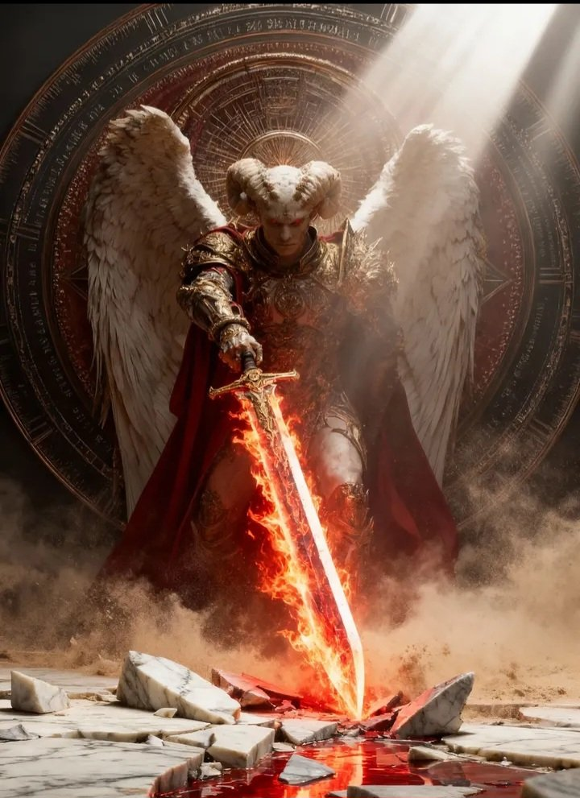

> [!NOTE]
> The source post tests cinematic, character, fashion, style, structured, or worldbuilding visual quality with visible media output.

<details>
<summary>Extrait de prompt/entrée</summary>

```text
A divine fallen angel warrior kneeling in the center of an ancient celestial temple, thrusting a massive flaming holy sword into a cracked white marble floor, the impact creating glowing lava-like fractures and flying debris. Gigantic pure white feathered wings spread wide behind the warrior, wearing ornate gold and crimson medieval armor with intricate engravings, a flowing dark red cape, and ram-like curled white horns. Glowing crimson eyes stare downward with an intense, wrathful expression.…
```

</details>

---
<a id="community-usecase-17"></a>

### Community Use Case 17: [Japanese casual portrait styling set](https://x.com/Cia0_exe/status/2075033845032993261) (by [@Cia0_exe](https://x.com/Cia0_exe))

Type: Demo | Date: 2026-07-09 | Category: Cinematic, Character & Style Visuals

Tags: `multi-image` `prompt-available`

<table><tr>
<td width="25%" valign="top">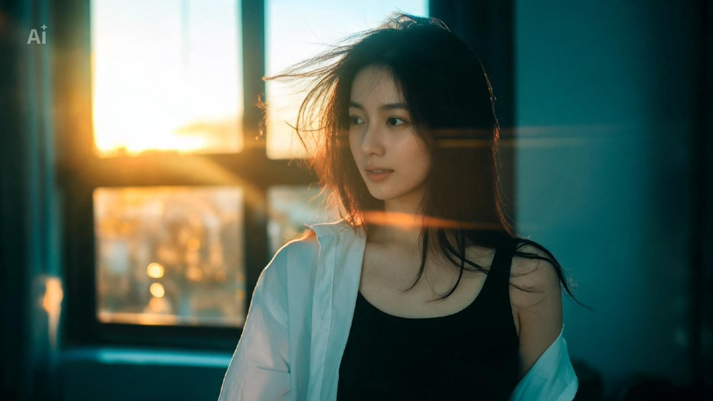</td>
<td width="25%" valign="top">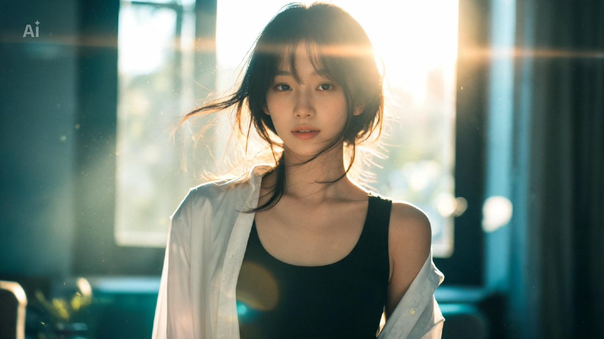</td>
<td width="25%" valign="top">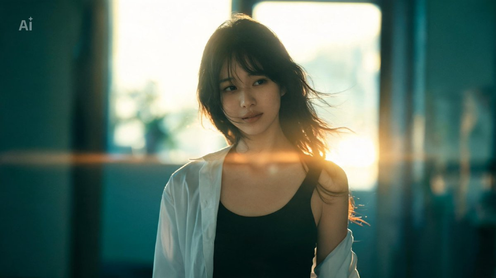</td>
<td width="25%" valign="top">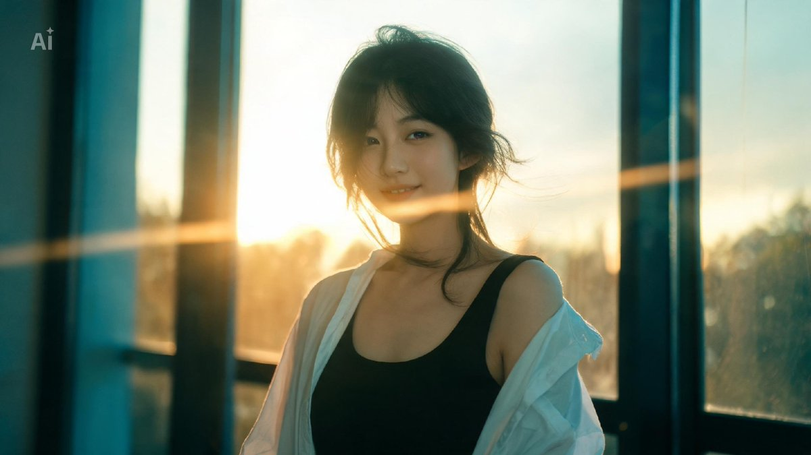</td>
</tr></table>

> [!NOTE]
> The source post tests cinematic, character, fashion, style, structured, or worldbuilding visual quality with visible media output.

<details>
<summary>Extrait de prompt/entrée</summary>

```text
A beautiful young Japanese woman, natural and effortless beauty, soft glowing skin, wearing a fitted black tank top layered under an oversized cool white shirt worn open, casual chic styling. Cinematic movie-grade shot, anamorphic lens flare, shallow depth of field with creamy bokeh, slow dolly-in camera movement, dramatic rim lighting from golden hour sun, subtle film grain, volumetric light rays through window, color graded like a Denis Villeneuve film teal and warm amber tones, 35mm anamorph…
```

</details>

---
<a id="community-usecase-18"></a>

### Community Use Case 18: [ARRI-style cinematic city close-up](https://x.com/df_reno/status/2075055332452106476) (by [@df_reno](https://x.com/df_reno))

Type: Demo | Date: 2026-07-09 | Category: Cinematic, Character & Style Visuals

Tags: `multi-image` `prompt-available`

<table><tr>
<td width="25%" valign="top">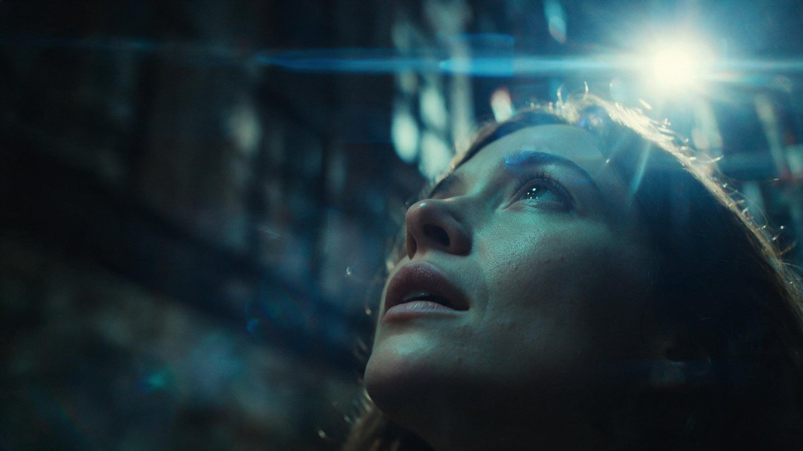</td>
<td width="25%" valign="top">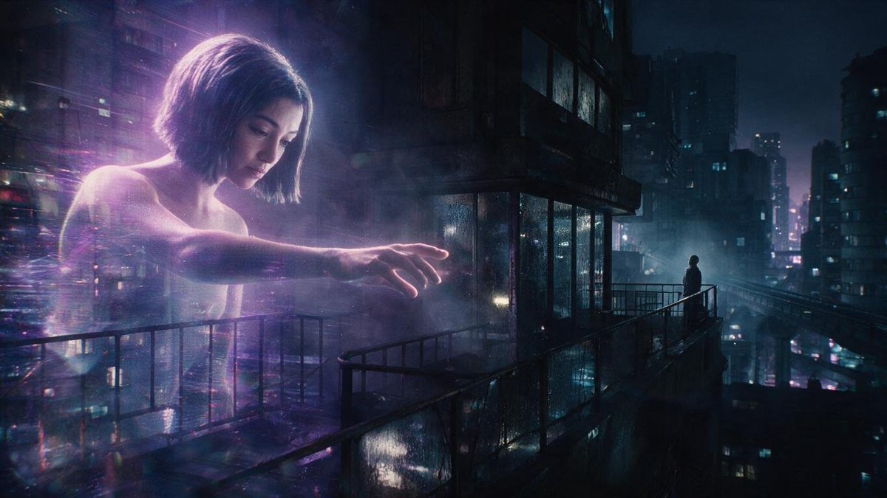</td>
<td width="25%" valign="top">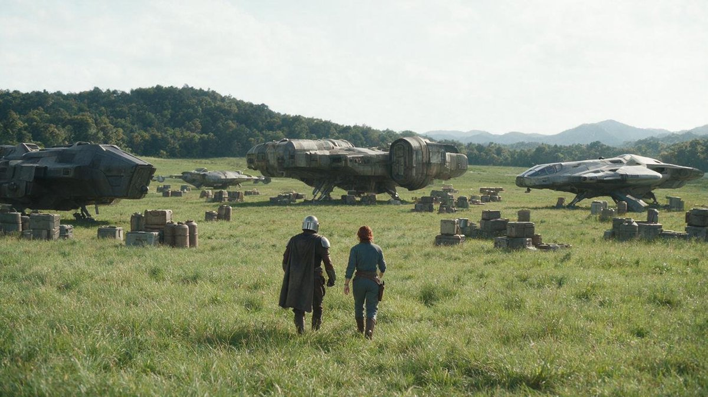</td>
<td width="25%" valign="top">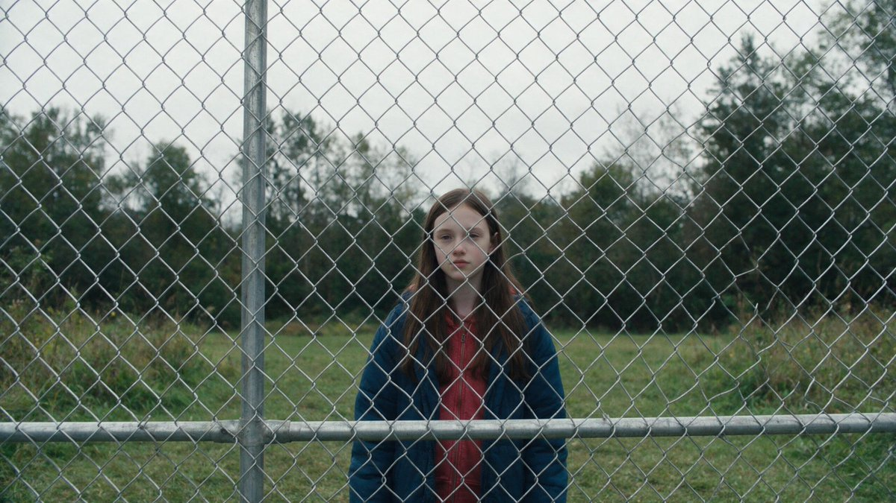</td>
</tr></table>

> [!NOTE]
> The source post tests cinematic, character, fashion, style, structured, or worldbuilding visual quality with visible media output.

<details>
<summary>Extrait de prompt/entrée</summary>

```text
超写实电影剧照，一位女性在昏暗的都市环境中仰望天空，画面极具感染力。使用 ARRI Alexa Mini LF 摄影机和 Panavision C 系列 50mm 变形镜头拍摄，光圈 T2，加装 Black Pro-Mist 1/8 滤镜，采用 2.39:1 变形宽银幕构图。低角度特写镜头，镜头略低于女性面部，营造出亲密的电影视角。女性位于画面右侧，左侧留出大片空白。 右上角背景中存在强烈的人工光源，产生强烈的变形镜头水平光晕、蓝白色的光晕、镜头内部反射、电影光晕效果以及柔和的高光。 光源并非阳光，而是远处城市路灯或工业灯光，并因浅景深而呈现出模糊效果。柔和的青色环境光部分照亮了女性的脸庞，展现出逼真的肌肤纹理、自然的毛孔、细微的瑕疵，嘴唇微张，眼神充满情感地向上凝视。前景包含模糊的暗色调环境元素。中景是女性的脸部和头发。背景是高度虚化的城市建筑，点缀着抽象的光影。深邃的阴影、低对比度的黑色、冷色调的蓝色调、逼真的夜景电影感、柯达胶片质感、细腻的颗粒感、变形光晕、朦胧的氛围，以及真实的电影画面。 A vast grassy field filled with several larg…
```

</details>

---
<a id="community-usecase-19"></a>

### Community Use Case 19: [Fashion outfit editorial set in a parking structure](https://x.com/ChillaiKalan__/status/2075071088137208063) (by [@ChillaiKalan__](https://x.com/ChillaiKalan__))

Type: Demo | Date: 2026-07-09 | Category: Cinematic, Character & Style Visuals

Tags: `multi-image` `prompt-available`

<table><tr>
<td width="25%" valign="top">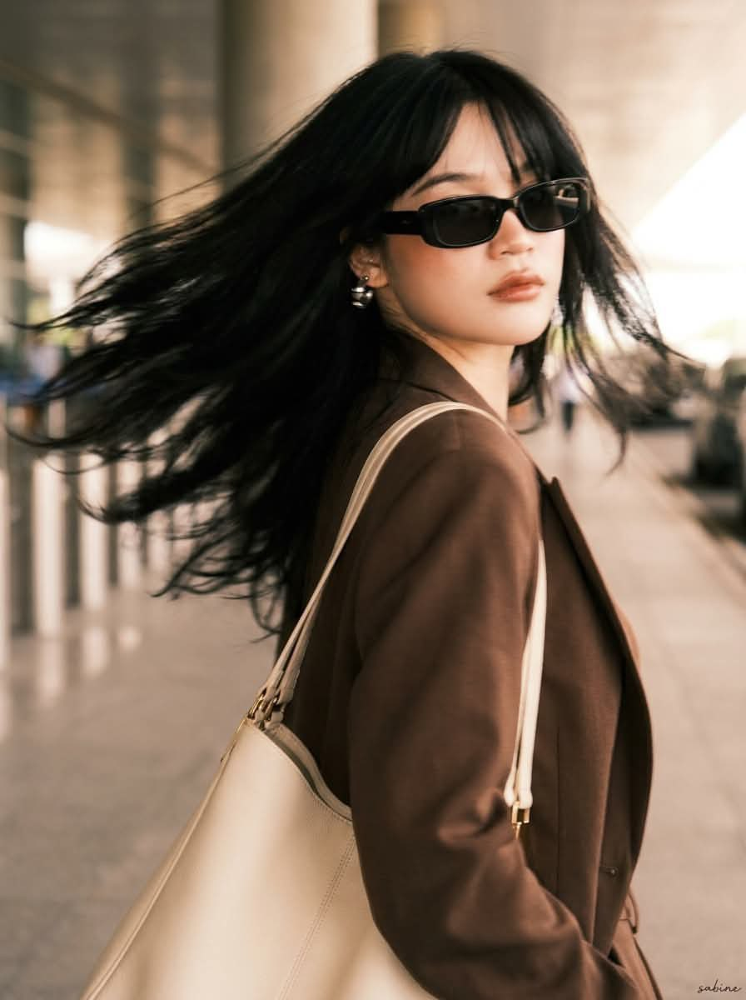</td>
<td width="25%" valign="top"></td>
<td width="25%" valign="top">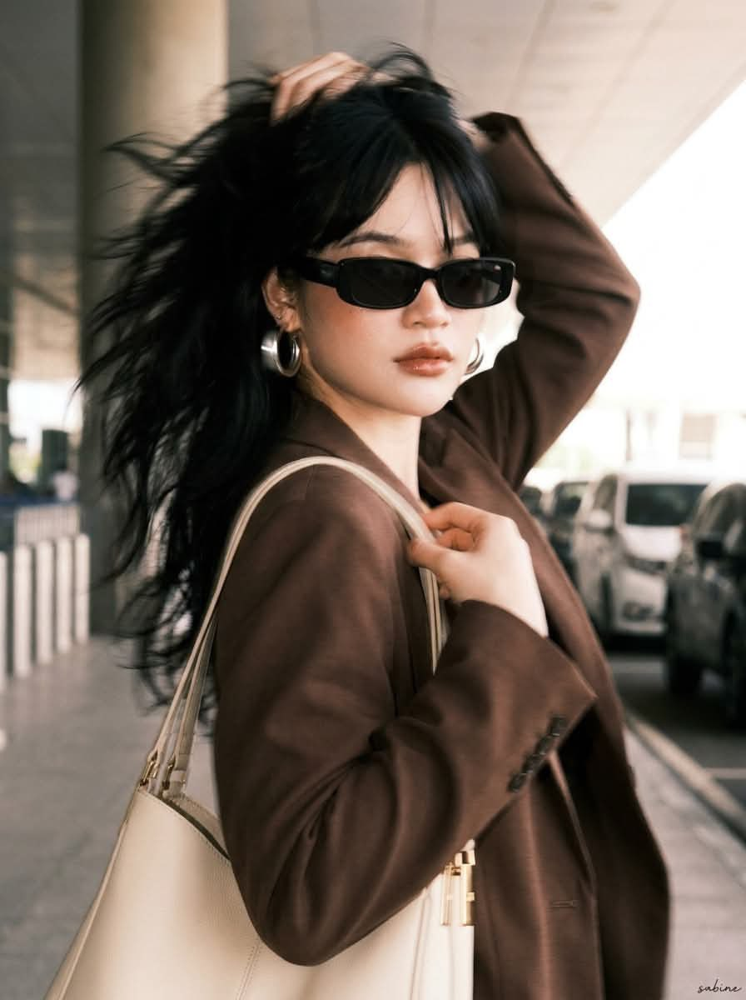</td>
<td width="25%" valign="top">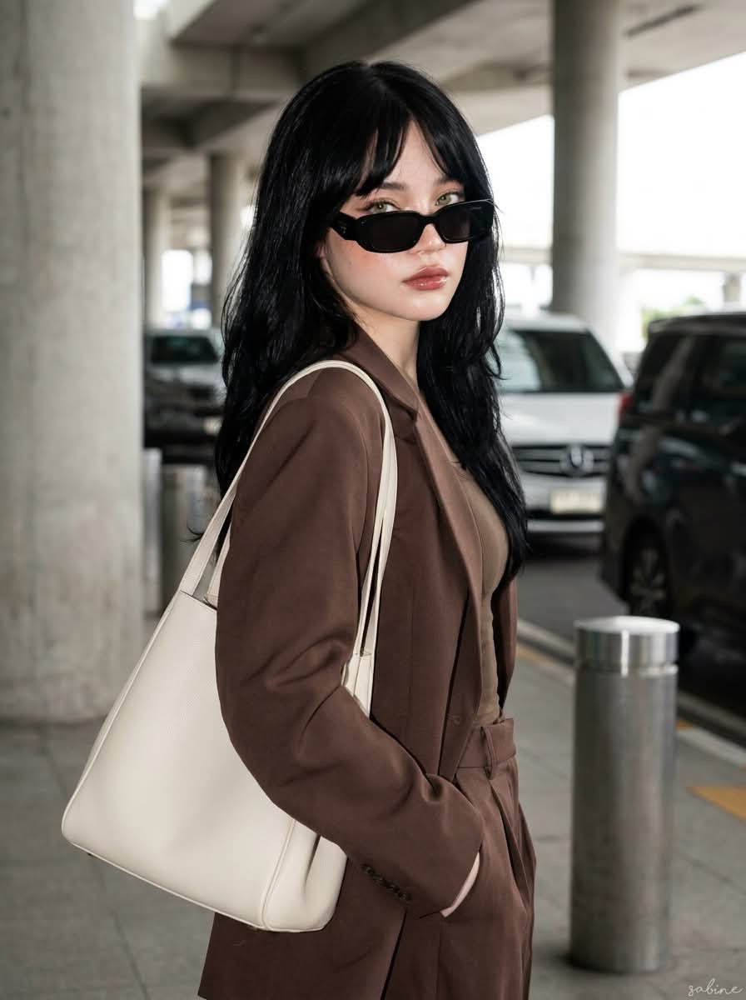</td>
</tr></table>

> [!NOTE]
> The source post tests cinematic, character, fashion, style, structured, or worldbuilding visual quality with visible media output.

<details>
<summary>Extrait de prompt/entrée</summary>

```text
A stylish young woman with long layered black hair and soft curtain bangs, wearing sleek black rectangular sunglasses, an oversized chocolate-brown tailored blazer with matching wide-leg trousers, and a fitted mocha-brown camisole. She carries a large structured ivory leather tote bag with gold hardware over one shoulder. Standing confidently with one hand in her pocket, looking back over her shoulder. Shot in a modern open-air parking structure beneath a concrete overpass, with parked cars sof…
```

</details>

---
<a id="community-usecase-20"></a>

### Community Use Case 20: [Iridescent glass-flower editorial poster](https://x.com/ComfyUI/status/2075027810666914062) (by [@ComfyUI](https://x.com/ComfyUI))

Type: Demo | Date: 2026-07-09 | Category: Cinematic, Character & Style Visuals

Tags: `prompt-available`


> [!NOTE]
> The source post tests cinematic, character, fashion, style, structured, or worldbuilding visual quality with visible media output.

<details>
<summary>Extrait de prompt/entrée</summary>

```text
An editorial graphic design poster on a solid black background. The central elements are exquisite, translucent 3D glass flowers with iridescent, holographic petals in shades of electric blue, violet, and soft purple. In the background, large, bold white sans-serif typography reads "Seedream 5.0 Pro", elegantly layered behind and interwoven with the glass petals. The layout is filled with clean blocks of small white placeholder body text and delicate thin white vector lines, creating a futurist…
```

</details>

---
<a id="community-usecase-21"></a>

### Community Use Case 21: [Anime skateboard sequence with multiple shot prompts](https://x.com/asatoucan/status/2075060881067769903) (by [@asatoucan](https://x.com/asatoucan))

Type: Demo | Date: 2026-07-09 | Category: Cinematic, Character & Style Visuals

Tags: `multi-image` `prompt-available`

<table><tr>
<td width="25%" valign="top">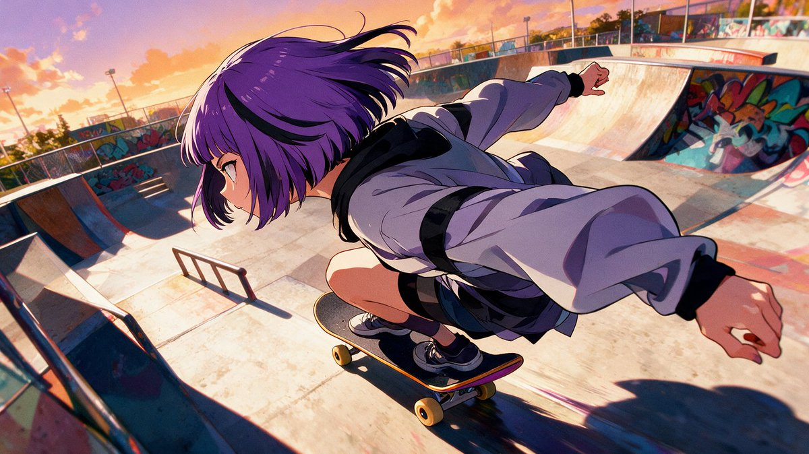</td>
<td width="25%" valign="top">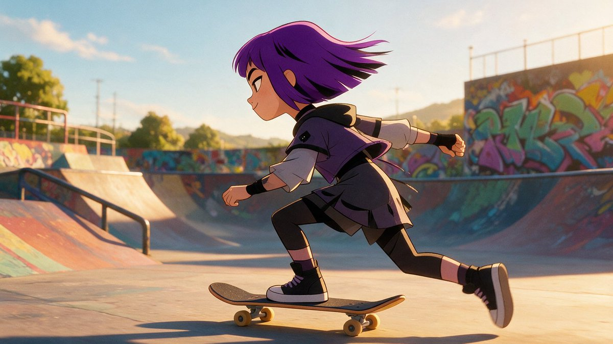</td>
<td width="25%" valign="top">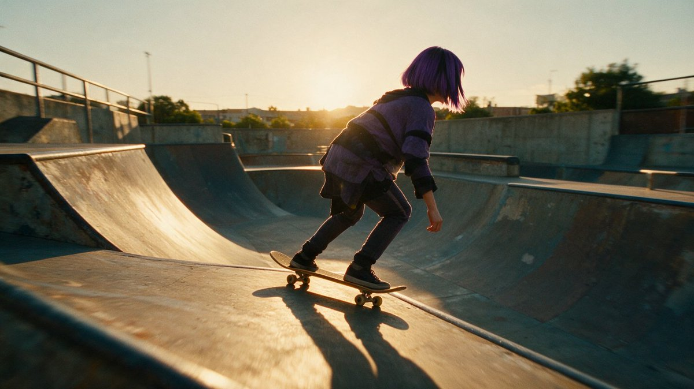</td>
<td width="25%" valign="top">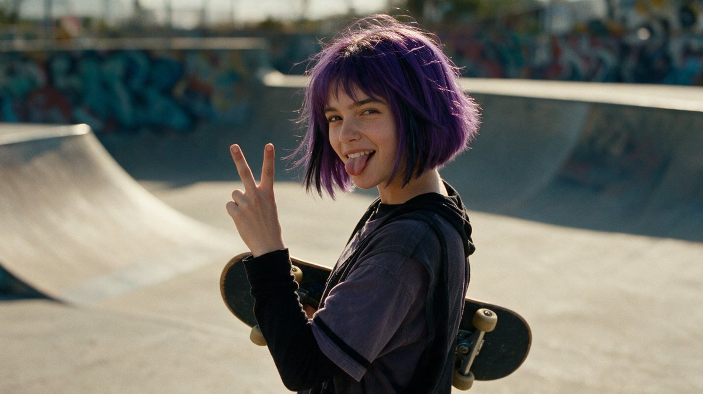</td>
</tr></table>

> [!NOTE]
> The source post tests cinematic, character, fashion, style, structured, or worldbuilding visual quality with visible media output.

<details>
<summary>Extrait de prompt/entrée</summary>

```text
A girl with a sharp bob cut, purple hair with black accent strands, stylized layered hair flowing in the wind, wearing layered cloth with black accents, riding a skateboard through a vibrant concrete skate park, captured from a dramatic high angle looking down at the front profile, dynamic action pose, body leaning into a turn, skate park ramps, rails, and colorful graffiti walls sprawling below, cel shaded, toon shading, hard shadows, bold outlines, anime style, vibrant flat colors, crisp line…
```

</details>

---
<a id="community-concept-environment-worldbuilding"></a>

### Concept art, environnement et worldbuilding

Nombre de cas d’usage: **3**.

<a id="community-usecase-22"></a>

### Community Use Case 22: [Solar-powered desert research station concept](https://x.com/ashen_one/status/2074915677815886071) (by [@ashen_one](https://x.com/ashen_one))

Type: Demo | Date: 2026-07-08 | Category: Concept Art, Environment & Worldbuilding

Tags: `prompt-available`

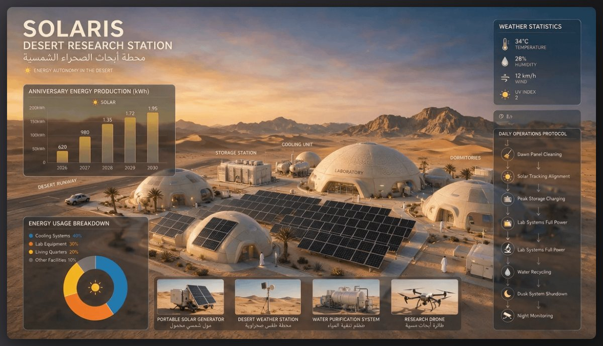

> [!NOTE]
> The source post tests cinematic, character, fashion, style, structured, or worldbuilding visual quality with visible media output.

<details>
<summary>Extrait de prompt/entrée</summary>

```text
A solar-powered research station in a desert, featuring domed structures, solar panels, and various equipment for energy and research management.
```

</details>

---
<a id="community-usecase-23"></a>

### Community Use Case 23: [Impossible-scale cinematic sci-fi worldbuilding set](https://x.com/AllaAisling/status/2075036565147906511) (by [@AllaAisling](https://x.com/AllaAisling))

Type: Demo | Date: 2026-07-09 | Category: Concept Art, Environment & Worldbuilding

Tags: `multi-image` `prompt-available`

<table><tr>
<td width="25%" valign="top">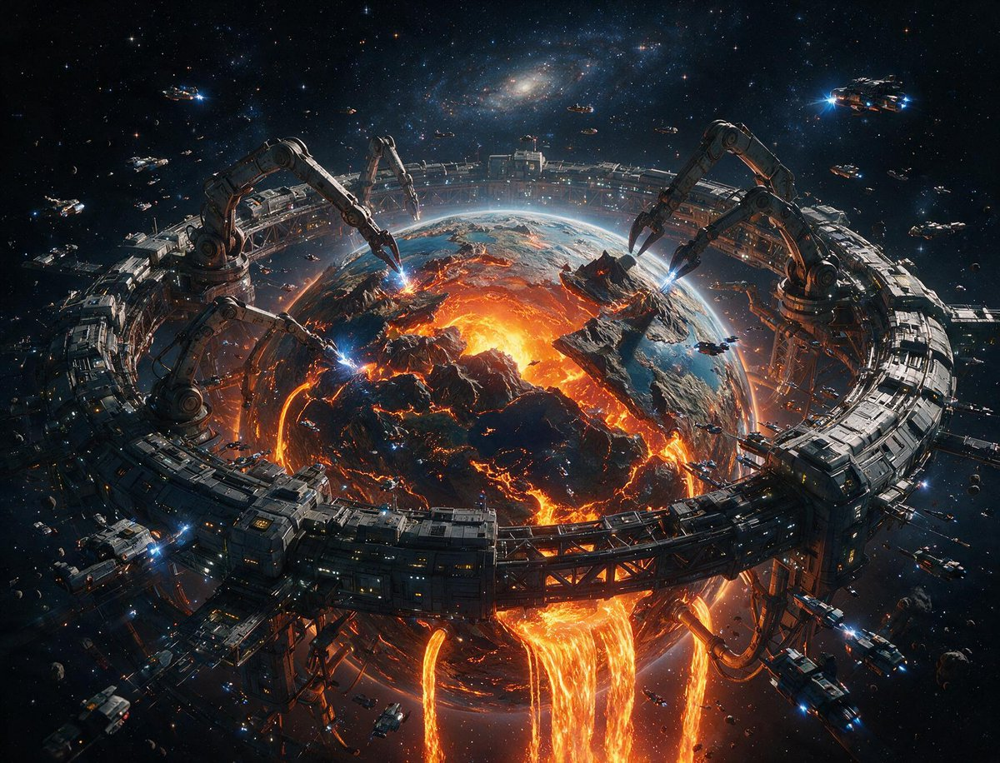</td>
<td width="25%" valign="top">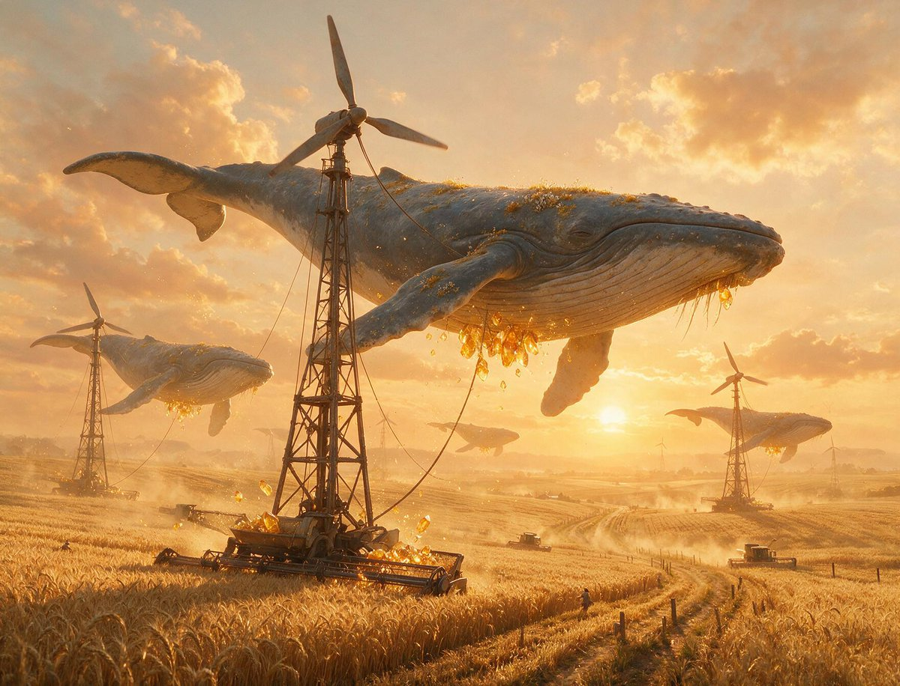</td>
<td width="25%" valign="top">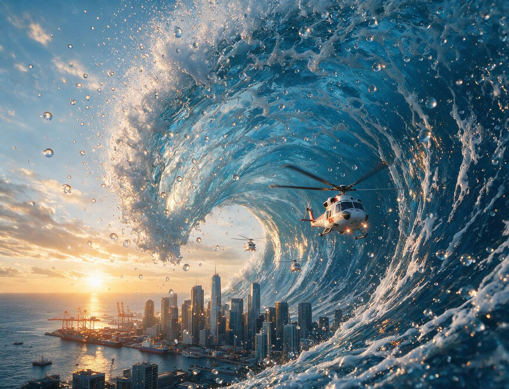</td>
<td width="25%" valign="top">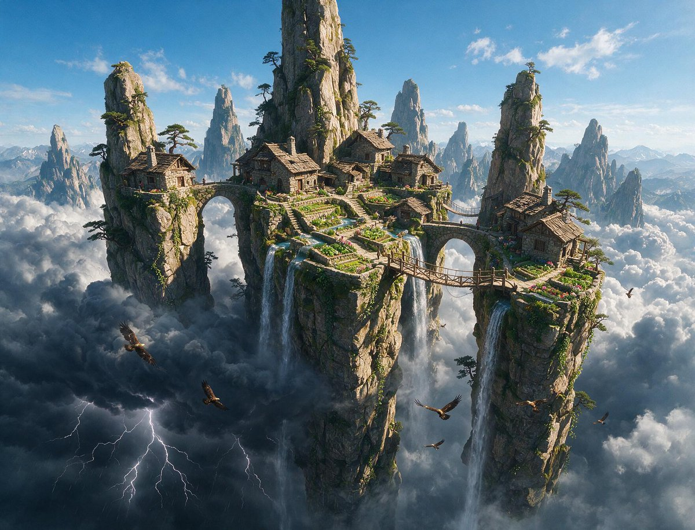</td>
</tr></table>

> [!NOTE]
> The source post tests cinematic, character, fashion, style, structured, or worldbuilding visual quality with visible media output.

<details>
<summary>Extrait de prompt/entrée</summary>

```text
An industrial civilization is constructing an entire planet inside an enormous orbital shipyard. Giant robotic arms hold continents in place while molten oceans are poured into gigantic basins. Thousands of spacecraft weld mountain ranges together. The unfinished world glows from its molten core. Unreal scale, NASA realism, cinematic science fiction. Gigantic floating whales drift above endless wheat fields while enormous wind-powered harvesting machines extend hundreds of meters into the sky t…
```

</details>

---
<a id="community-usecase-24"></a>

### Community Use Case 24: [Bedroom design variations for MBTI types](https://x.com/FloraTechAI/status/2074866317484794131) (by [@FloraTechAI](https://x.com/FloraTechAI))

Type: Demo | Date: 2026-07-08 | Category: Concept Art, Environment & Worldbuilding

Tags: `multi-image` `prompt-available`

<table><tr>
<td width="25%" valign="top">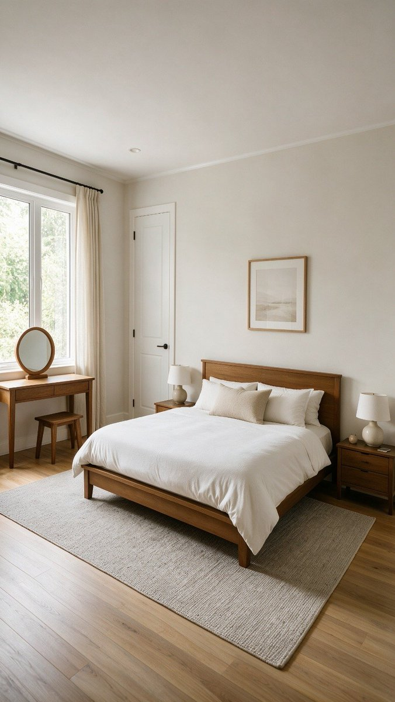</td>
<td width="25%" valign="top">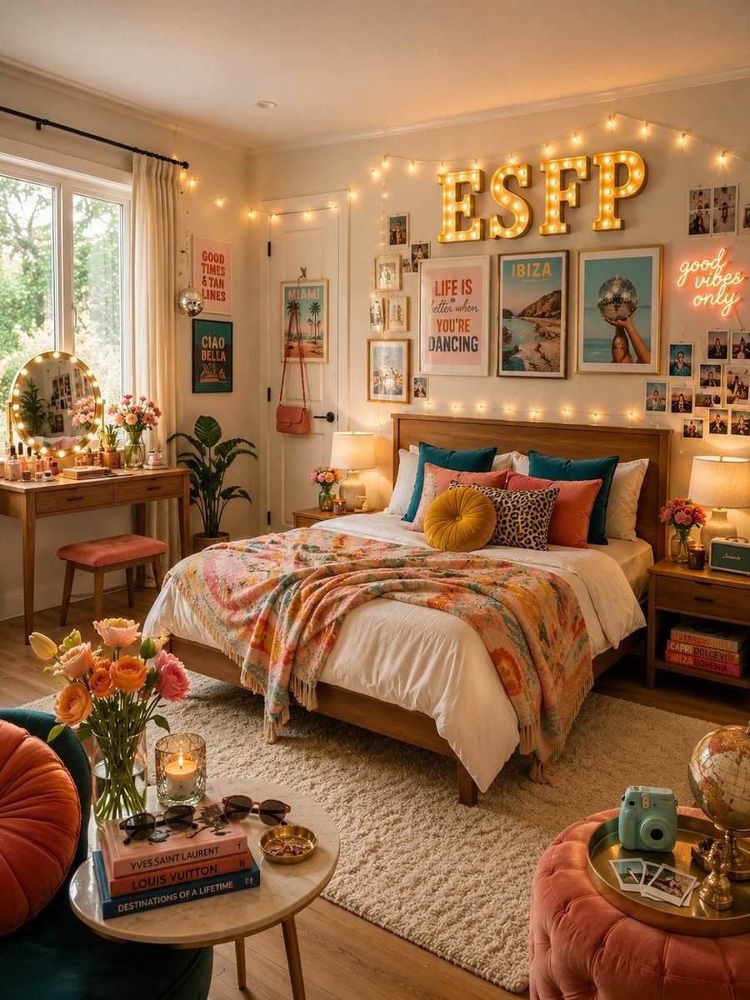</td>
<td width="25%" valign="top">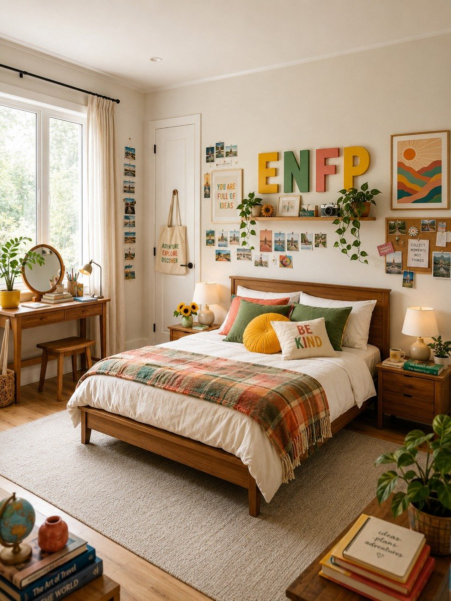</td>
<td width="25%" valign="top">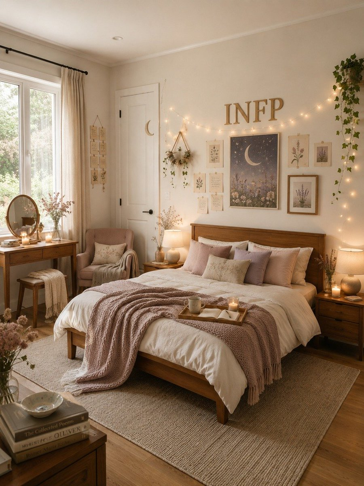</td>
</tr></table>

> [!NOTE]
> The source post tests cinematic, character, fashion, style, structured, or worldbuilding visual quality with visible media output.

<details>
<summary>Extrait de prompt/entrée</summary>

```text
design a bedroom for each MBTI type
```

</details>

---
<a id="community-model-comparisons"></a>

### Comparaisons et évaluations de modèles

Nombre de cas d’usage: **11**.

<a id="community-usecase-25"></a>

### Community Use Case 25: [Multi-task Seedream capability sampling from four Chinese prompts](https://x.com/op7418/status/2074862226905948549) (by [@op7418](https://x.com/op7418))

Type: Evaluation | Date: 2026-07-08 | Category: Model Comparisons & Evaluations

Tags: `capability-sampling` `model-comparison` `multi-image` `prompt-available`

<table><tr>
<td width="25%" valign="top">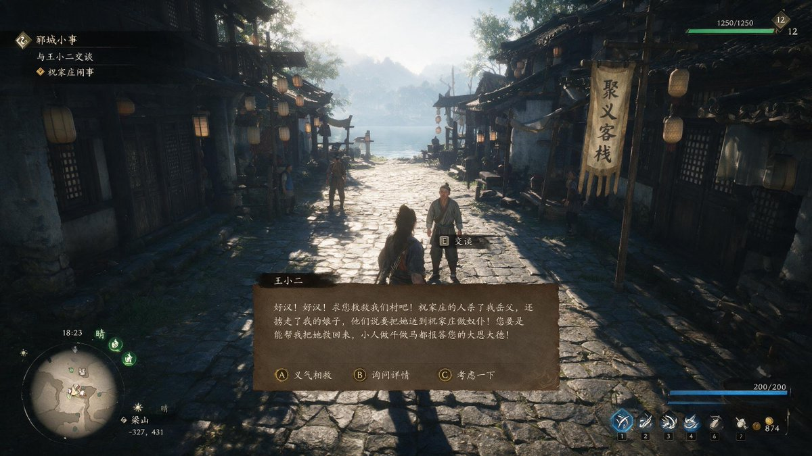</td>
<td width="25%" valign="top">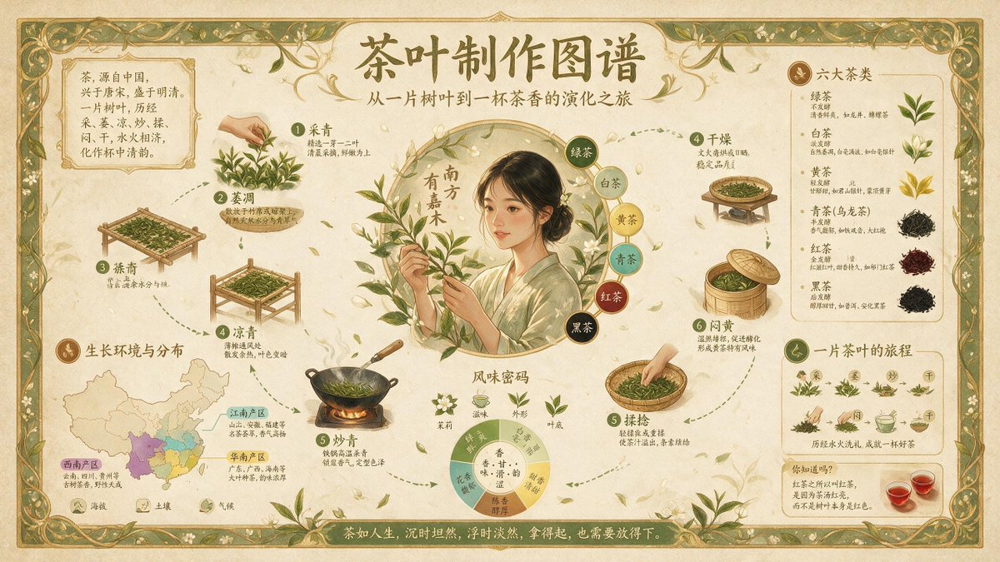</td>
<td width="25%" valign="top"></td>
<td width="25%" valign="top">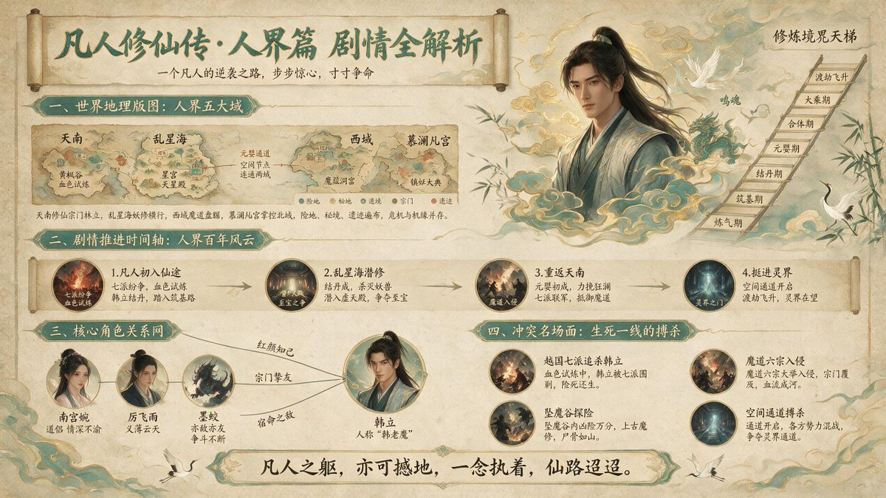</td>
</tr></table>

> [!NOTE]
> The source post samples several task types in one thread, so it works best as a broad capability check rather than a single-purpose case.

<details>
<summary>Extrait de prompt/entrée</summary>

```text
1. 一句话让它生成《黑神话：水浒传》的一个游戏截图 2. 让他生成一张茶叶制作和品种的科普图 3. 给它一个参考图，让它基于这个参考图的组件生成一个 Web 的 UI 设计稿 4. 让他用一张图介绍《凡人修仙传：人界篇》的剧情
```

</details>

---
<a id="community-usecase-26"></a>

### Community Use Case 26: [Seedream vs GPT Image 2 in realistic car selfie framing](https://x.com/johnAGI168/status/2074870910469677387) (by [@johnAGI168](https://x.com/johnAGI168))

Type: Evaluation | Date: 2026-07-08 | Category: Model Comparisons & Evaluations

Tags: `model-comparison` `multi-image` `prompt-available`

<table><tr>
<td width="25%" valign="top">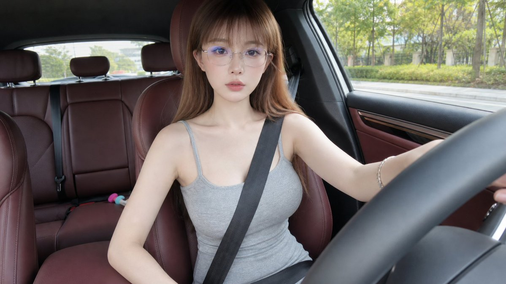</td>
<td width="25%" valign="top">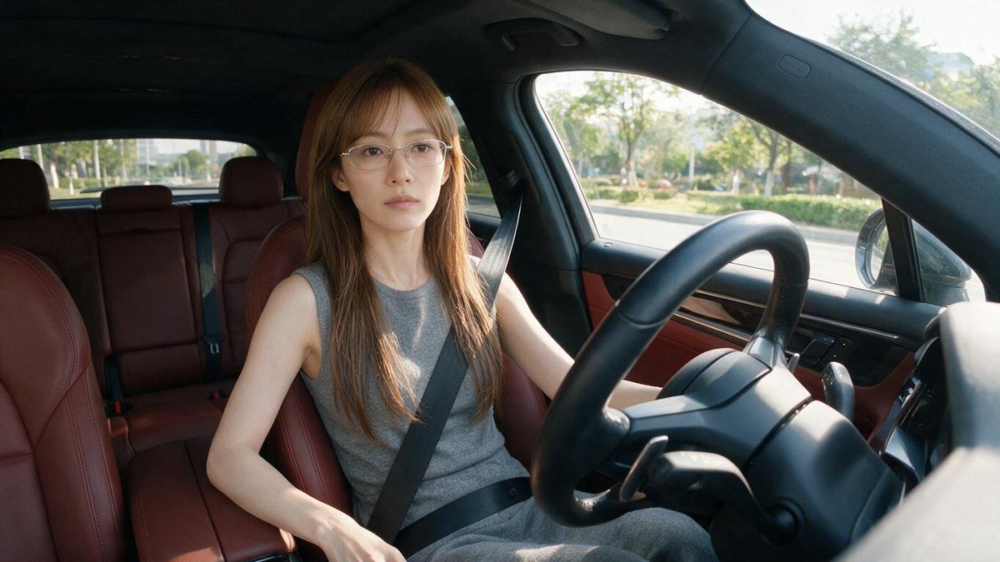</td>
</tr></table>

> [!NOTE]
> The source post compares Seedream 5.0 Pro with another model on the same or closely related visual task.

<details>
<summary>Extrait de prompt/entrée</summary>

```text
生成一张真实感车内自拍视频首帧照片，横屏 16:9。画面像固定在副驾驶前方或中控台附近的小型广角相机拍摄，轻微广角，近距离车内第一视角，像社交媒体短视频截图。 主角是一位成年女性，气质清冷、安静、精致，整体像日常车内自拍视频里的主角。她脸型小巧偏鹅蛋脸，五官自然精致，鼻梁挺，嘴唇自然，表情平静、淡淡的，有一点冷感但不夸张。她正面面向镜头或略微看向前方，能清楚看到完整正脸，不低头，不侧脸。她戴细框透明或浅银色眼镜，长直发偏浅棕色，带轻微空气刘海，头发自然垂落在肩侧。穿简洁灰色无袖针织连衣裙或灰色无袖上衣搭配同色下装，造型干净日常、端庄自然。 她坐在驾驶位，安全带已经插好并固定完成：黑色安全带清楚地从肩膀斜跨过上身到腰侧，状态自然贴合身体，不是在拉安全带，也不是正在插卡扣。她一只手自然放在方向盘附近或轻扶方向盘，另一只手放低在座椅边或腿侧，姿态像准备开车前刚坐正的一瞬间。表情专注平静，眼神可以看向镜头，也可以略微看向前方道路。 车内是红棕色真皮座椅和红棕色门板，方向盘在画面右前方形成明显前景，仪表台、车窗边缘和后排座椅可见。车窗外是白天城市道路旁的绿化、树木和轻微模糊的街景，但车子此刻看…
```

</details>

---
<a id="community-usecase-27"></a>

### Community Use Case 27: [Seedream vs GPT Image 2 for clean lifestyle portrait styling](https://x.com/liyue_ai/status/2074890690686005590) (by [@liyue_ai](https://x.com/liyue_ai))

Type: Evaluation | Date: 2026-07-08 | Category: Model Comparisons & Evaluations

Tags: `model-comparison` `multi-image` `prompt-available`

<table><tr>
<td width="25%" valign="top"></td>
<td width="25%" valign="top">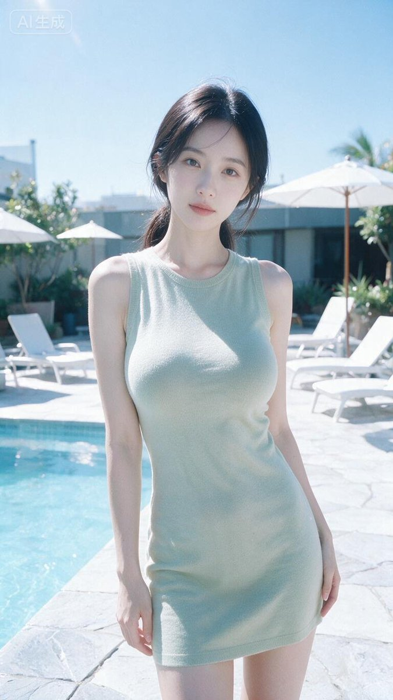</td>
</tr></table>

> [!NOTE]
> The source post compares Seedream 5.0 Pro with another model on the same or closely related visual task.

<details>
<summary>Extrait de prompt/entrée</summary>

```text
摄影风格：冷白清透CCD生活照风 写真方向：轻熟生活照 场景方向：酒店泳池外步道 / 白色躺椅 / 浅蓝池水 / 简洁遮阳伞 服装方向：浅鼠尾草色修身无袖针织短裙 气质标签：温柔、清透、轻熟、安静、有吸引力 五官方向：真实清透自然脸，安静干净，不网红 五官细节：柔和鹅蛋脸，面部轮廓自然；清亮杏眼，眼神温柔安静；鼻型流畅小巧；唇形柔软克制，低饱和裸粉唇色；整体是安静、通透、舒服的生活感美人脸 发型方向：自然黑长发或低扎发，发丝顺滑，额前少量碎发，带一点微风感 身形方向：轻盈纤细，上围饱满自然 线条强调：强 镜头方向：大腿及上半身 姿态动作：站在泳池步道边，身体轻微侧向镜头，一只手自然垂落，另一只手轻扶裙侧 光线氛围：高色温晴天自然光 + 水面反射光 + 冷白极弱柔闪 滤镜效果：冷白高光 + 蓝白清透生活照色彩 + 轻颗粒 + 轻数码噪点 + 轻微过曝 画幅比例：9:16 补充要求：连衣裙贴身柔软，突出胸部轮廓、腰线和整体修长感，人物五官要安静耐看，整体要冷白清爽，不要商业泳池大片感
```

</details>

---
<a id="community-usecase-28"></a>

### Community Use Case 28: [Blueprint sports car comparison against GPT Image 2](https://x.com/marmaduke091/status/2074866077499105416) (by [@marmaduke091](https://x.com/marmaduke091))

Type: Evaluation | Date: 2026-07-08 | Category: Model Comparisons & Evaluations

Tags: `model-comparison` `multi-image` `prompt-available`

<table><tr>
<td width="25%" valign="top">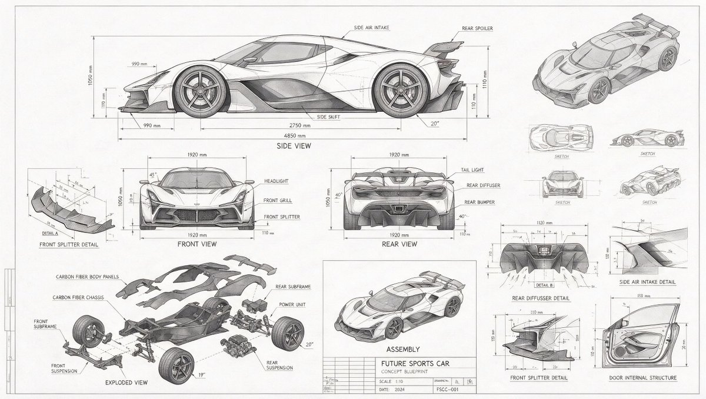</td>
<td width="25%" valign="top">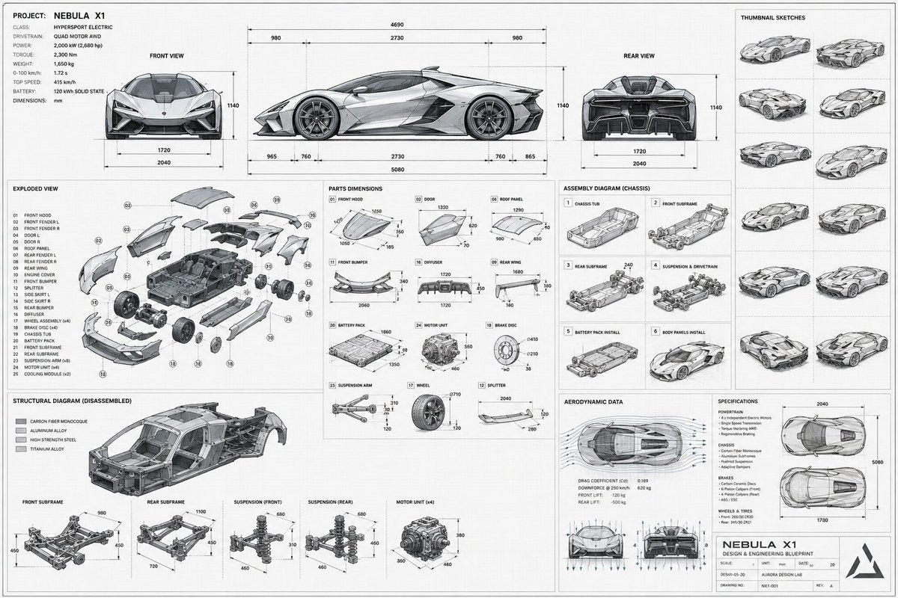</td>
</tr></table>

> [!NOTE]
> The source post compares Seedream 5.0 Pro with another model on the same or closely related visual task.

<details>
<summary>Extrait de prompt/entrée</summary>

```text
A technical drawing of a futuristic sports car in blueprint style. Include line drawings of the sports car from the front, side, and rear views, exploded parts sketches, parts assembly diagrams, and structural diagrams of disassembled components. Use abundant lines and measurement values to indicate the dimensions of each part, with grayscale tones expressing the overall sketch relationship. In addition to the main design, also show scattered thumbnails from different angles.
```

</details>

---
<a id="community-usecase-29"></a>

### Community Use Case 29: [Reference-image camera-angle change comparison](https://x.com/hasamaru_studio/status/2075052934409375918) (by [@hasamaru_studio](https://x.com/hasamaru_studio))

Type: Evaluation | Date: 2026-07-09 | Category: Model Comparisons & Evaluations

Tags: `image-input` `model-comparison` `multi-image` `prompt-available`

<table><tr>
<td width="25%" valign="top">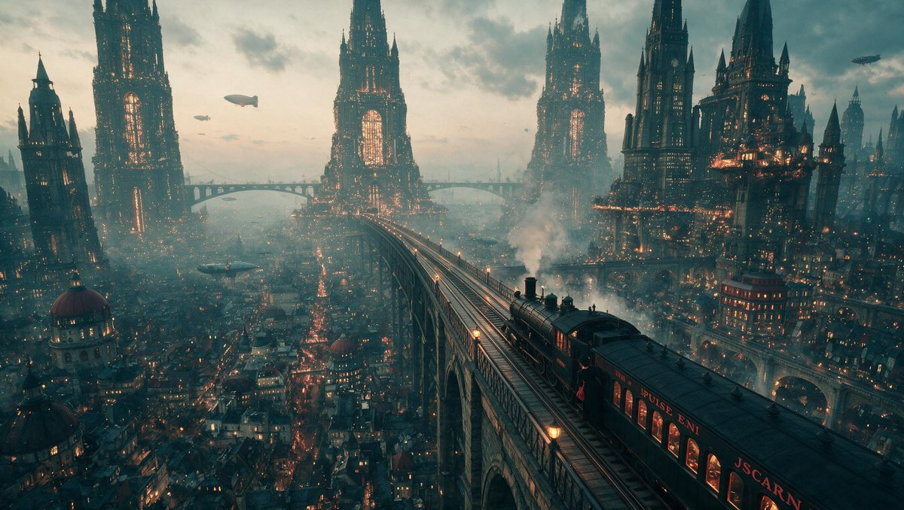</td>
<td width="25%" valign="top">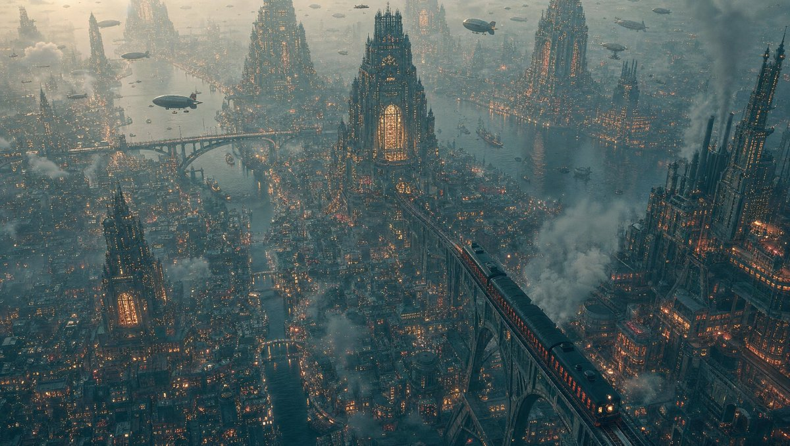</td>
<td width="25%" valign="top">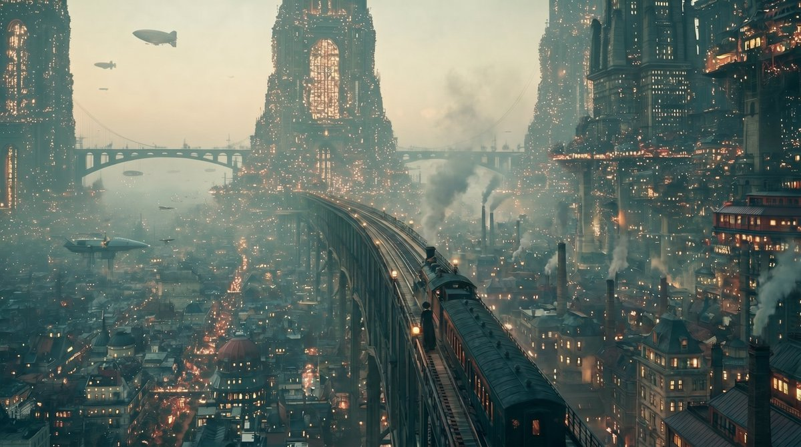</td>
<td width="25%" valign="top">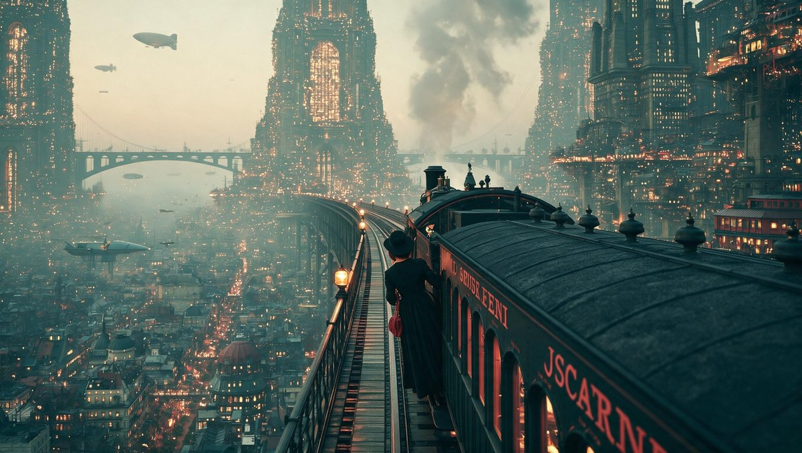</td>
</tr></table>

> [!NOTE]
> The source post compares Seedream 5.0 Pro with another model on the same or closely related visual task.

<details>
<summary>Extrait de prompt/entrée</summary>

```text
リファレンス画像のスタイルを保ったまま、もう少し高い位置からの画角に変更してもらいました。
```

</details>

---
<a id="community-usecase-30"></a>

### Community Use Case 30: [Oversized beverage-can advertising composition comparison](https://x.com/emmanuel_2m/status/2075000101362131350) (by [@emmanuel_2m](https://x.com/emmanuel_2m))

Type: Evaluation | Date: 2026-07-08 | Category: Model Comparisons & Evaluations

Tags: `model-comparison` `multi-image` `prompt-available`

<table><tr>
<td width="25%" valign="top">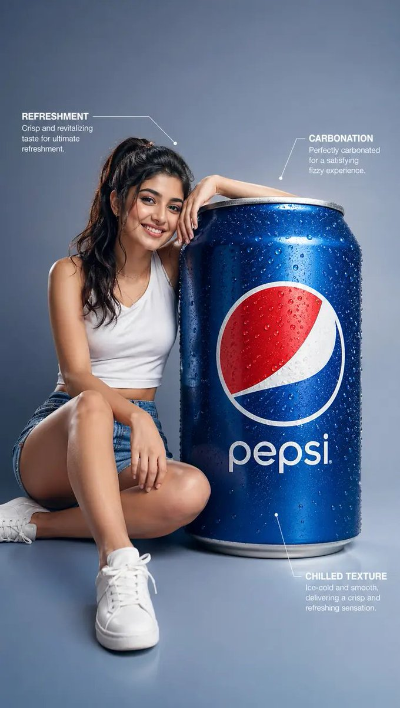</td>
<td width="25%" valign="top">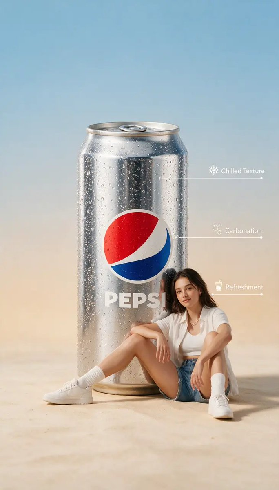</td>
</tr></table>

> [!NOTE]
> The source post compares Seedream 5.0 Pro with another model on the same or closely related visual task.

<details>
<summary>Extrait de prompt/entrée</summary>

```text
A premium infographic-style advertisement featuring an oversized Pepsi can placed beside a young woman. The can is scaled to be nearly the same size as her entire seated body, creating a striking surreal proportion. The woman sits casually leaning against the giant can, one arm resting on it, interacting naturally. The Pepsi can is ultra-detailed with crisp branding, condensation droplets, realistic reflections, and metallic texture. The logo is clean, sharp, and properly proportioned. Composit…
```

</details>

---
<a id="community-usecase-31"></a>

### Community Use Case 31: [Chengdu travel scrapbook poster comparison](https://x.com/DeepBlueAIX/status/2074872447229419956) (by [@DeepBlueAIX](https://x.com/DeepBlueAIX))

Type: Evaluation | Date: 2026-07-08 | Category: Model Comparisons & Evaluations

Tags: `model-comparison` `multi-image` `prompt-available`

<table><tr>
<td width="25%" valign="top">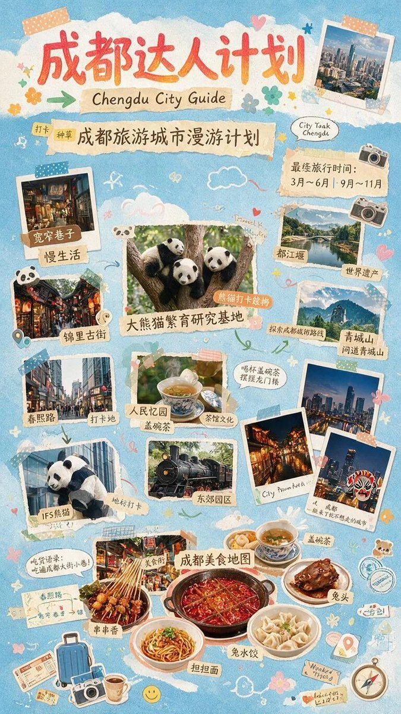</td>
<td width="25%" valign="top">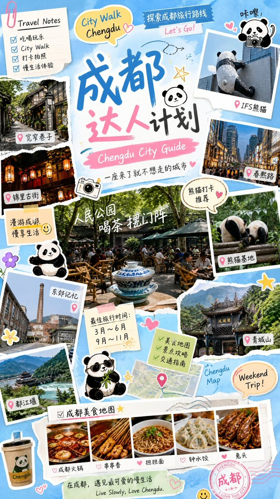</td>
</tr></table>

> [!NOTE]
> The source post compares Seedream 5.0 Pro with another model on the same or closely related visual task.

<details>
<summary>Extrait de prompt/entrée</summary>

```text
成都旅游 · 小红书手帐风海报 一张竖版 9:16 的小红书风格拼贴海报，主题为**「成都旅游城市漫游计划」**。整体采用手帐风设计，像旅行日记一样丰富、有生活感和轻松氛围。 画面以成都城市旅行为核心内容，包含宽窄巷子、锦里古街、春熙路、IFS熊猫、成都大熊猫繁育研究基地、东郊记忆、都江堰、青城山等真实场景照片，以拼贴方式散落在画面中，搭配撕纸边框与胶带装饰。画面中穿插熊猫元素、茶馆、人民公园、盖碗茶、街头巷尾、夜市、美食街、城市天际线等真实旅行场景，充分展现成都悠闲惬意的慢生活氛围。 整体视觉使用天蓝色作为主色调，并点缀粉色、浅黄色与柔和绿色，营造清新明亮又富有烟火气的城市旅行氛围。 画面中加入大量手帐元素，例如手绘箭头、涂鸦星星、对话气泡、便签标签、贴纸装饰、旅行地图、定位图标、拍立得照片、胶带、旅行印章、熊猫贴纸、相机、咖啡杯、小花、云朵、笑脸图标等，使画面具有强烈的小红书「种草笔记」视觉风格。 主标题为**「成都达人计划 / Chengdu City Guide」，采用手写感或涂鸦字体，具有明显的年轻化社交媒体风格。画面中穿插中英文混排文字，如「City Walk Cheng…
```

</details>

---
<a id="community-usecase-32"></a>

### Community Use Case 32: [Anime key-visual comparison](https://x.com/roco_kn_roco/status/2074890020260094137) (by [@roco_kn_roco](https://x.com/roco_kn_roco))

Type: Evaluation | Date: 2026-07-08 | Category: Model Comparisons & Evaluations

Tags: `model-comparison` `prompt-available`

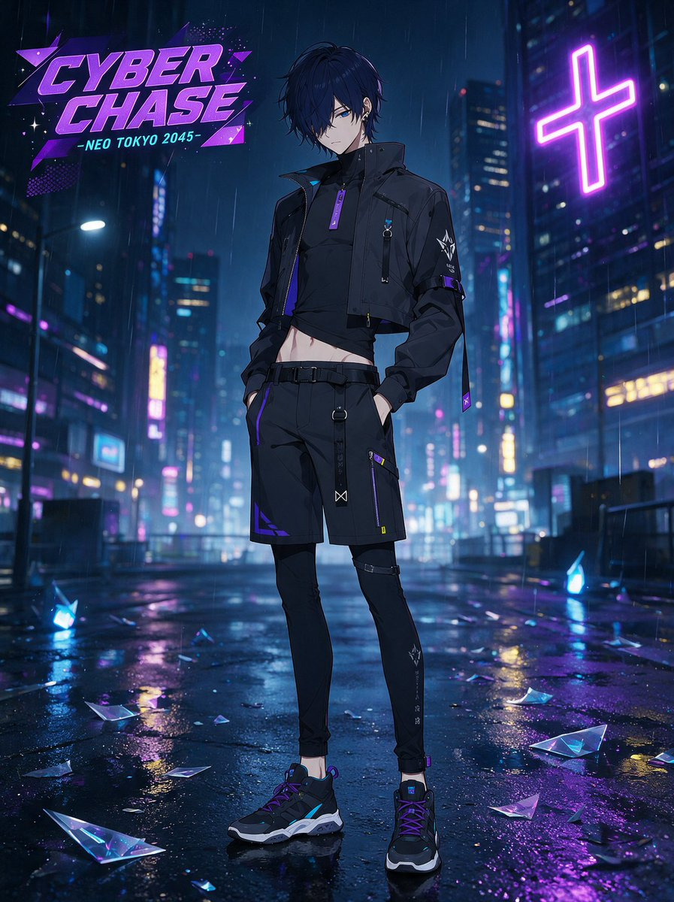

> [!NOTE]
> The source post compares Seedream 5.0 Pro with another model on the same or closely related visual task.

<details>
<summary>Extrait de prompt/entrée</summary>

```text
新作アニメのキービジュアルを作って下さい
```

</details>

---
<a id="community-usecase-33"></a>

### Community Use Case 33: [Travel-poster comparison with signature constraint](https://x.com/Bic_Revelation/status/2074959714366922857) (by [@Bic_Revelation](https://x.com/Bic_Revelation))

Type: Evaluation | Date: 2026-07-08 | Category: Model Comparisons & Evaluations

Tags: `model-comparison` `multi-image` `prompt-available`

<table><tr>
<td width="25%" valign="top"></td>
<td width="25%" valign="top"></td>
</tr></table>

> [!NOTE]
> The source post compares Seedream 5.0 Pro with another model on the same or closely related visual task.

<details>
<summary>Extrait de prompt/entrée</summary>

```text
With its crystal-clear waters, white sandy beaches, and vibrant coral reefs, the Maldives is a tropical paradise perfect for exotic and tranquil visuals. SIGNATURE: 'BicRevelation' cursive script lower-left.
```

</details>

---
<a id="community-usecase-34"></a>

### Community Use Case 34: [Fantasy village watermill comparison against GPT Image 2](https://x.com/emmanuel_2m/status/2075000114427375742) (by [@emmanuel_2m](https://x.com/emmanuel_2m))

Type: Evaluation | Date: 2026-07-08 | Category: Model Comparisons & Evaluations

Tags: `model-comparison` `multi-image` `prompt-available`

<table><tr>
<td width="25%" valign="top">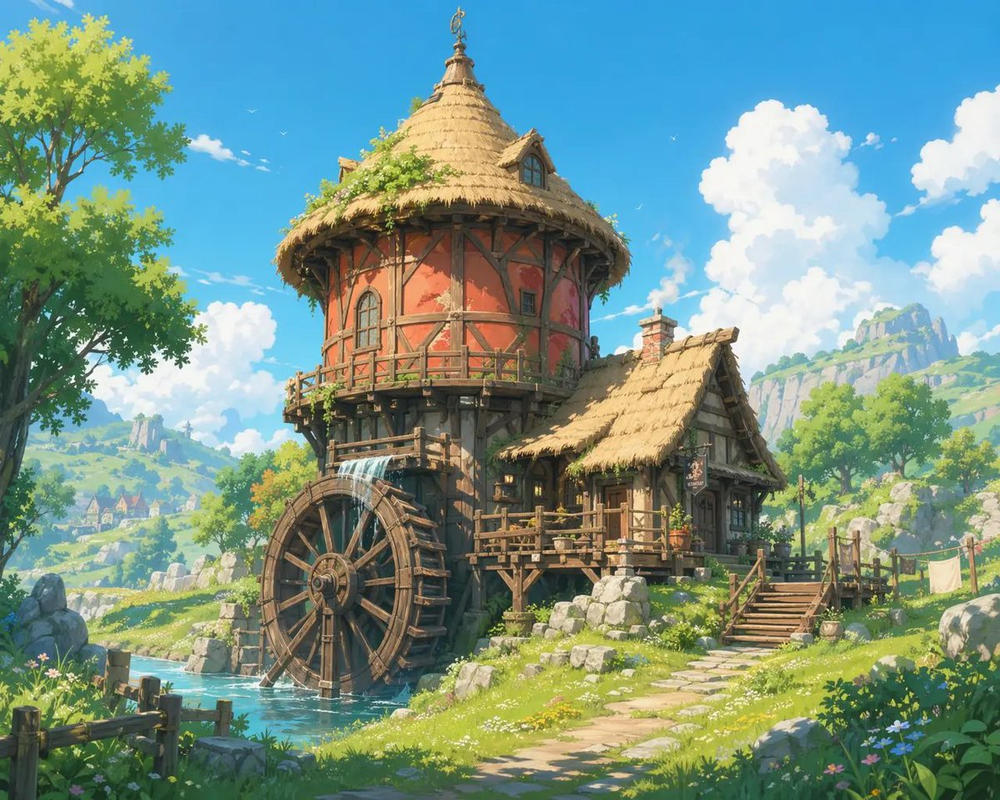</td>
<td width="25%" valign="top">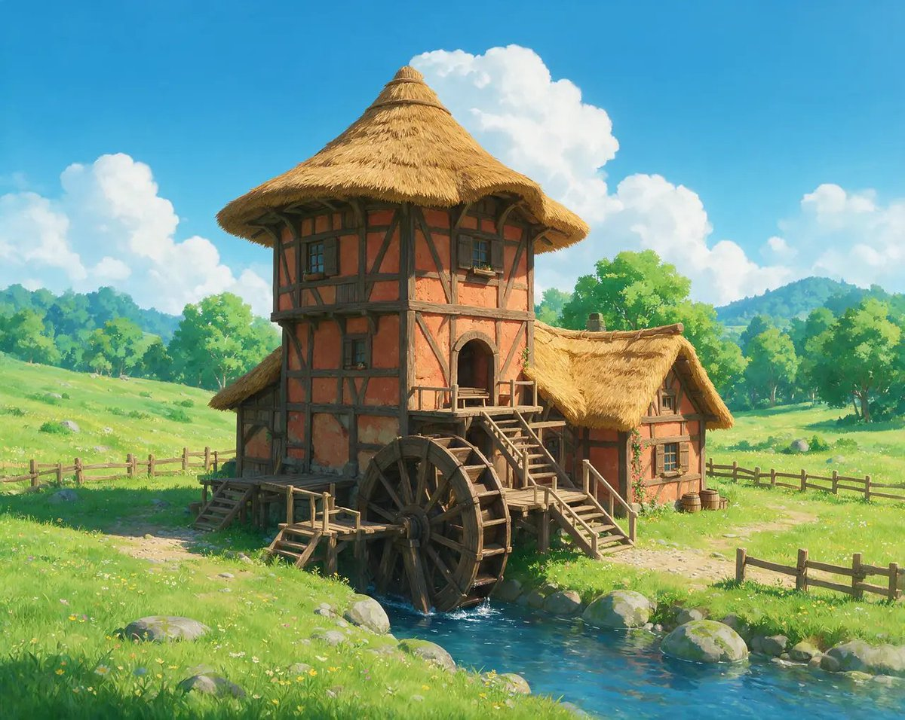</td>
</tr></table>

> [!NOTE]
> The source post compares Seedream 5.0 Pro with another model on the same or closely related visual task.

<details>
<summary>Extrait de prompt/entrée</summary>

```text
stylized stylized fantasy village watermill, two-story half-timbered red-clay tower w/ thatched conical roof, big wooden water-wheel, attached small thatched cottage, wooden walkways and stairs, lush green meadow w/ stones, painterly Genshin-Impact / Studio Ghibli env art, fluffy cumulus clouds, sunny midday
```

</details>

---
<a id="community-usecase-35"></a>

### Community Use Case 35: [Lake Como fashion scene comparison against Banana Pro](https://x.com/cso6709/status/2075046425277399261) (by [@cso6709](https://x.com/cso6709))

Type: Evaluation | Date: 2026-07-09 | Category: Model Comparisons & Evaluations

Tags: `model-comparison` `multi-image` `prompt-available`

<table><tr>
<td width="25%" valign="top">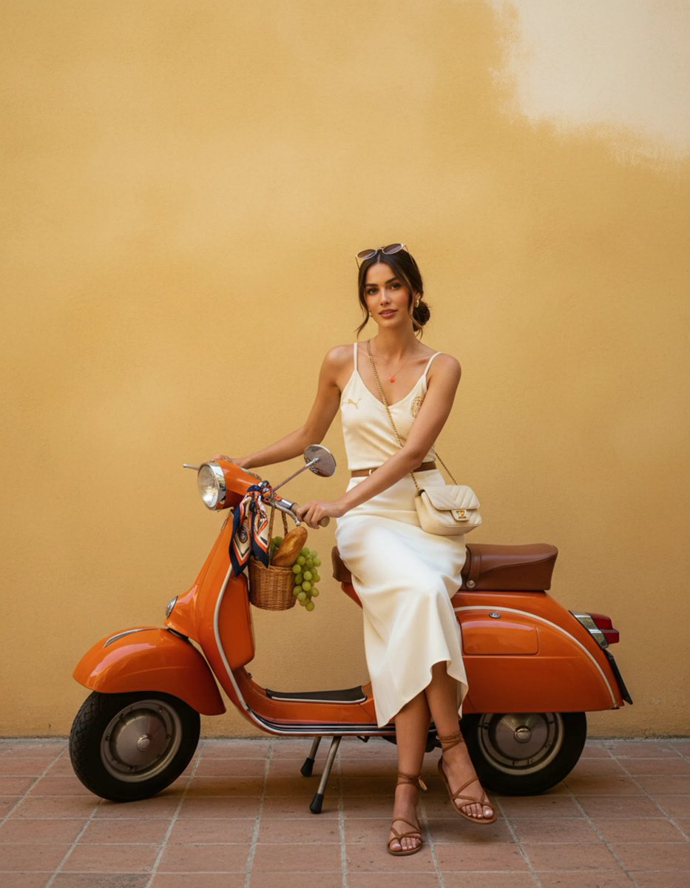</td>
<td width="25%" valign="top">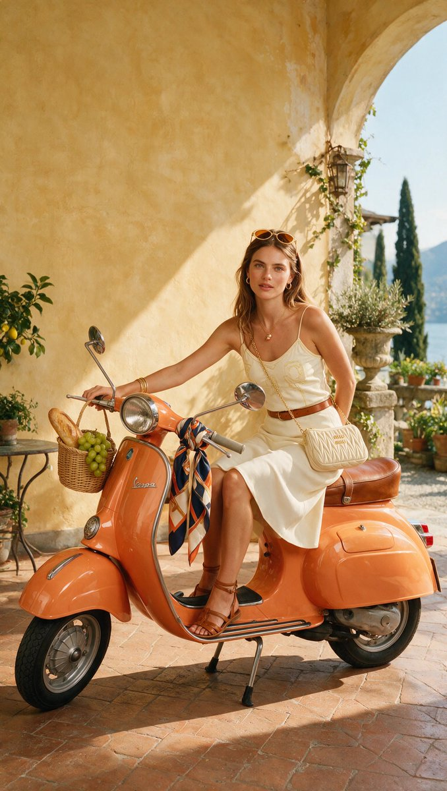</td>
</tr></table>

> [!NOTE]
> The source post compares Seedream 5.0 Pro with another model on the same or closely related visual task.

<details>
<summary>Extrait de prompt/entrée</summary>

```text
A straight-on medium-wide cinematic shot at eye-level, static locked frame, 4:5 vertical, captures a sun-bright late-morning inside a Lake Como villa courtyard room, camera perpendicular to the wall plane with no tilt, the atmosphere crisp and alive like the minute before heading out for gelato, the wall behind the scene a warm hand-troweled sable butter-yellow lime plaster slightly uneven with soft sun-bleach along the upper right edge, the floor matte burnt-terracotta chili tile grounding the…
```

</details>

---

<a id="prompt-library"></a>

## 🧾 Bibliothèque de prompts

Le texte de prompt et d’entrée reste séparé de la taxonomie des cas d’usage.

Prompt-bearing community entries: **35**.

- [Community Use Case 1: Japanese no-makeup image edit instruction](#community-usecase-1)
  - Source: [post](https://x.com/renataro9/status/2075059699112652908) by [@renataro9](https://x.com/renataro9)

- [Community Use Case 2: Localized anime edit preserving composition while changing one subject](#community-usecase-2)
  - Source: [post](https://x.com/haruuraeadss/status/2075035201391255593) by [@haruuraeadss](https://x.com/haruuraeadss)

- [Community Use Case 3: Image-input cat-to-mecha transformation](#community-usecase-3)
  - Source: [post](https://x.com/JennyAITech/status/2074870477651398972) by [@JennyAITech](https://x.com/JennyAITech)

- [Community Use Case 4: Trading terminal interface with market microstructure detail](#community-usecase-4)
  - Source: [post](https://x.com/MishikaAI/status/2074879603446026333) by [@MishikaAI](https://x.com/MishikaAI)

- [Community Use Case 5: Cyberpunk android graphic poster](#community-usecase-5)
  - Source: [post](https://x.com/ComfyUI/status/2075027793491226677) by [@ComfyUI](https://x.com/ComfyUI)

- [Community Use Case 6: Premium sports footwear commercial ad set](#community-usecase-6)
  - Source: [post](https://x.com/iamrealsnow/status/2075063569486598281) by [@iamrealsnow](https://x.com/iamrealsnow)

- [Community Use Case 7: Kids clay craft advertisement poster](#community-usecase-7)
  - Source: [post](https://x.com/Strength04_X/status/2075063250656621054) by [@Strength04_X](https://x.com/Strength04_X)

- [Community Use Case 8: Measurement-heavy technical blueprint rendering](#community-usecase-8)
  - Source: [post](https://x.com/LiamEtherson/status/2074862867442962667) by [@LiamEtherson](https://x.com/LiamEtherson)

- [Community Use Case 9: Concept car blueprint with exploded technical views](#community-usecase-9)
  - Source: [post](https://x.com/AiwithZohaib/status/2074880584107909602) by [@AiwithZohaib](https://x.com/AiwithZohaib)

- [Community Use Case 10: Shot-list driven grayscale scene planning](#community-usecase-10)
  - Source: [post](https://x.com/munzxsdv/status/2074865454485483885) by [@munzxsdv](https://x.com/munzxsdv)

- [Community Use Case 11: Single-prompt 16-panel cavalry storyboard](#community-usecase-11)
  - Source: [post](https://x.com/sulekhat95/status/2074966196563431636) by [@sulekhat95](https://x.com/sulekhat95)

- [Community Use Case 12: Fisheye editorial portraits with miniature clone motif](#community-usecase-12)
  - Source: [post](https://x.com/magnific/status/2074872903938846900) by [@magnific](https://x.com/magnific)

- [Community Use Case 13: Melting-world-landmarks concept generation](#community-usecase-13)
  - Source: [post](https://x.com/magnific/status/2074918700709523881) by [@magnific](https://x.com/magnific)

- [Community Use Case 14: Photorealistic high-fashion portrait lighting](#community-usecase-14)
  - Source: [post](https://x.com/BubbleBrain/status/2074856963591290979) by [@BubbleBrain](https://x.com/BubbleBrain)

- [Community Use Case 15: Natural phone-photo scene at San Francisco sunset](#community-usecase-15)
  - Source: [post](https://x.com/mattworkman/status/2074850550349222210) by [@mattworkman](https://x.com/mattworkman)

- [Community Use Case 16: Fantasy fallen-angel warrior key visual](#community-usecase-16)
  - Source: [post](https://x.com/SimplyAnnisa/status/2074900816662774189) by [@SimplyAnnisa](https://x.com/SimplyAnnisa)

- [Community Use Case 17: Japanese casual portrait styling set](#community-usecase-17)
  - Source: [post](https://x.com/Cia0_exe/status/2075033845032993261) by [@Cia0_exe](https://x.com/Cia0_exe)

- [Community Use Case 18: ARRI-style cinematic city close-up](#community-usecase-18)
  - Source: [post](https://x.com/df_reno/status/2075055332452106476) by [@df_reno](https://x.com/df_reno)

- [Community Use Case 19: Fashion outfit editorial set in a parking structure](#community-usecase-19)
  - Source: [post](https://x.com/ChillaiKalan__/status/2075071088137208063) by [@ChillaiKalan__](https://x.com/ChillaiKalan__)

- [Community Use Case 20: Iridescent glass-flower editorial poster](#community-usecase-20)
  - Source: [post](https://x.com/ComfyUI/status/2075027810666914062) by [@ComfyUI](https://x.com/ComfyUI)

- [Community Use Case 21: Anime skateboard sequence with multiple shot prompts](#community-usecase-21)
  - Source: [post](https://x.com/asatoucan/status/2075060881067769903) by [@asatoucan](https://x.com/asatoucan)

- [Community Use Case 22: Solar-powered desert research station concept](#community-usecase-22)
  - Source: [post](https://x.com/ashen_one/status/2074915677815886071) by [@ashen_one](https://x.com/ashen_one)

- [Community Use Case 23: Impossible-scale cinematic sci-fi worldbuilding set](#community-usecase-23)
  - Source: [post](https://x.com/AllaAisling/status/2075036565147906511) by [@AllaAisling](https://x.com/AllaAisling)

- [Community Use Case 24: Bedroom design variations for MBTI types](#community-usecase-24)
  - Source: [post](https://x.com/FloraTechAI/status/2074866317484794131) by [@FloraTechAI](https://x.com/FloraTechAI)

- [Community Use Case 25: Multi-task Seedream capability sampling from four Chinese prompts](#community-usecase-25)
  - Source: [post](https://x.com/op7418/status/2074862226905948549) by [@op7418](https://x.com/op7418)

- [Community Use Case 26: Seedream vs GPT Image 2 in realistic car selfie framing](#community-usecase-26)
  - Source: [post](https://x.com/johnAGI168/status/2074870910469677387) by [@johnAGI168](https://x.com/johnAGI168)

- [Community Use Case 27: Seedream vs GPT Image 2 for clean lifestyle portrait styling](#community-usecase-27)
  - Source: [post](https://x.com/liyue_ai/status/2074890690686005590) by [@liyue_ai](https://x.com/liyue_ai)

- [Community Use Case 28: Blueprint sports car comparison against GPT Image 2](#community-usecase-28)
  - Source: [post](https://x.com/marmaduke091/status/2074866077499105416) by [@marmaduke091](https://x.com/marmaduke091)

- [Community Use Case 29: Reference-image camera-angle change comparison](#community-usecase-29)
  - Source: [post](https://x.com/hasamaru_studio/status/2075052934409375918) by [@hasamaru_studio](https://x.com/hasamaru_studio)

- [Community Use Case 30: Oversized beverage-can advertising composition comparison](#community-usecase-30)
  - Source: [post](https://x.com/emmanuel_2m/status/2075000101362131350) by [@emmanuel_2m](https://x.com/emmanuel_2m)

- [Community Use Case 31: Chengdu travel scrapbook poster comparison](#community-usecase-31)
  - Source: [post](https://x.com/DeepBlueAIX/status/2074872447229419956) by [@DeepBlueAIX](https://x.com/DeepBlueAIX)

- [Community Use Case 32: Anime key-visual comparison](#community-usecase-32)
  - Source: [post](https://x.com/roco_kn_roco/status/2074890020260094137) by [@roco_kn_roco](https://x.com/roco_kn_roco)

- [Community Use Case 33: Travel-poster comparison with signature constraint](#community-usecase-33)
  - Source: [post](https://x.com/Bic_Revelation/status/2074959714366922857) by [@Bic_Revelation](https://x.com/Bic_Revelation)

- [Community Use Case 34: Fantasy village watermill comparison against GPT Image 2](#community-usecase-34)
  - Source: [post](https://x.com/emmanuel_2m/status/2075000114427375742) by [@emmanuel_2m](https://x.com/emmanuel_2m)

- [Community Use Case 35: Lake Como fashion scene comparison against Banana Pro](#community-usecase-35)
  - Source: [post](https://x.com/cso6709/status/2075046425277399261) by [@cso6709](https://x.com/cso6709)

<a id="model-notes"></a>

## 🧩 Notes du modèle

| Élément | Note fondée sur la source |
|---|---|
| ID du modèle | Le matériel officiel mentionne `dola-seedream-5-0-pro-260628`; une vérification runtime EvoLink reste nécessaire avant d’en faire une preuve de première exécution. |
| Images d’entrée | Le matériel officiel indique que Seedream 5.0 Pro prend en charge jusqu’à 10 images d’entrée. |
| Résolution de sortie | Ne revendiquez pas la 4K pour Pro ; la source décrit des paliers de sortie autour de `<= 2.36M` pixels et `> 2.36M` pixels. |
| Langues natives de prompt | Le matériel officiel cite l’arabe, l’anglais, le russe, l’indonésien, l’espagnol, l’allemand, le turc, le portugais, le malais, le vietnamien, le français, le japonais, le coréen, le tagalog et le thaï. |
| Chemin Seedream vers Seedance | Le matériel officiel indique que les sorties Seedream 5.0 Pro/Lite peuvent devenir des entrées fiables pour les workflows image-vers-vidéo de la famille Seedance, sous conditions de compte et de modération. |

<a id="acknowledge"></a>

## 🙏 Remerciements

Ce dépôt a été créé à partir du matériel officiel de lancement Seedream 5.0 Pro exporté le 8 juillet 2026 et des corrections officielles concernant l’inventaire des cas.

- Les URL privées de source officielle sont conservées uniquement dans les preuves locales d’audit.
- Les blocs de prompt ne sont inclus que lorsque le matériel officiel fournit le texte du prompt.
- Les cas avec média uniquement restent média uniquement ; les prompts manquants ne sont pas inventés.

*Si une frontière de cas public doit être corrigée, ouvrez une issue ou envoyez un patch avec une preuve source concrète.*
