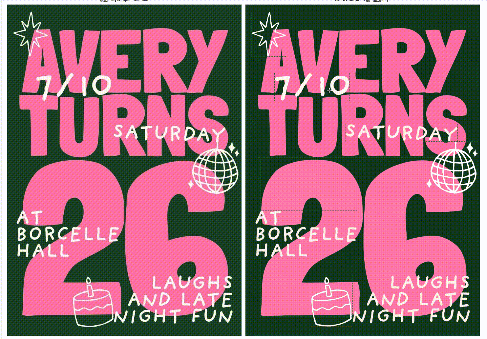
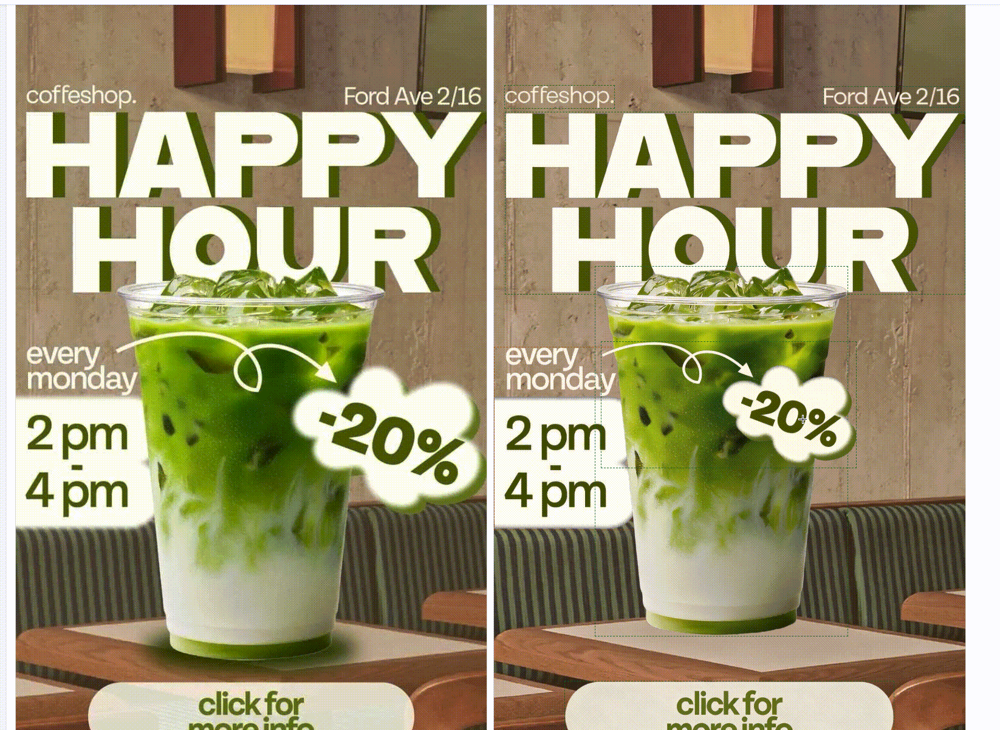
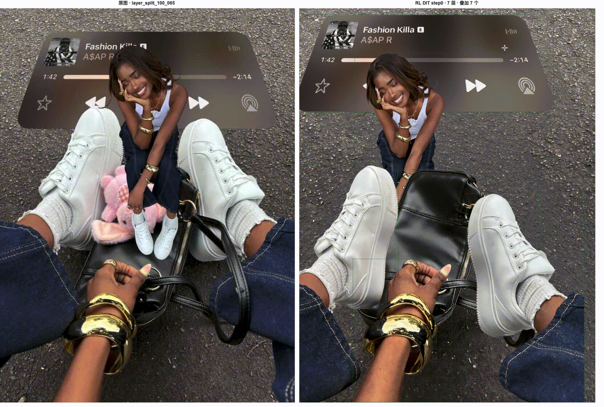
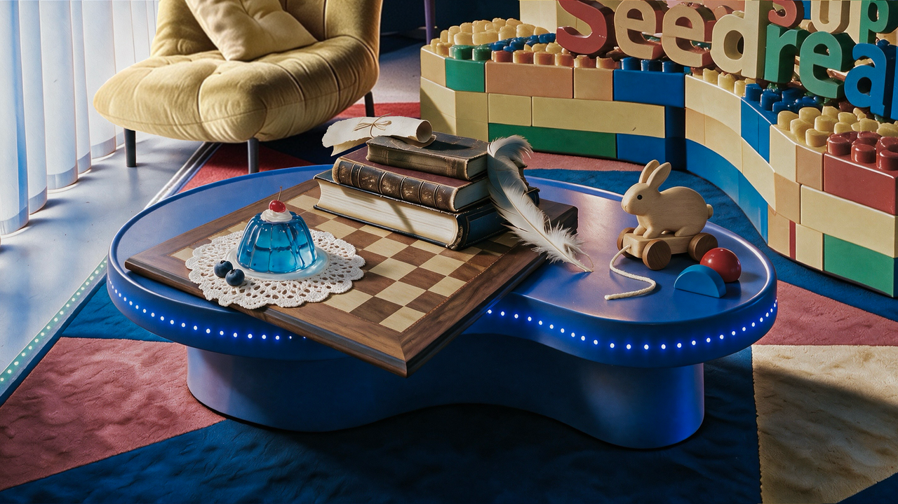
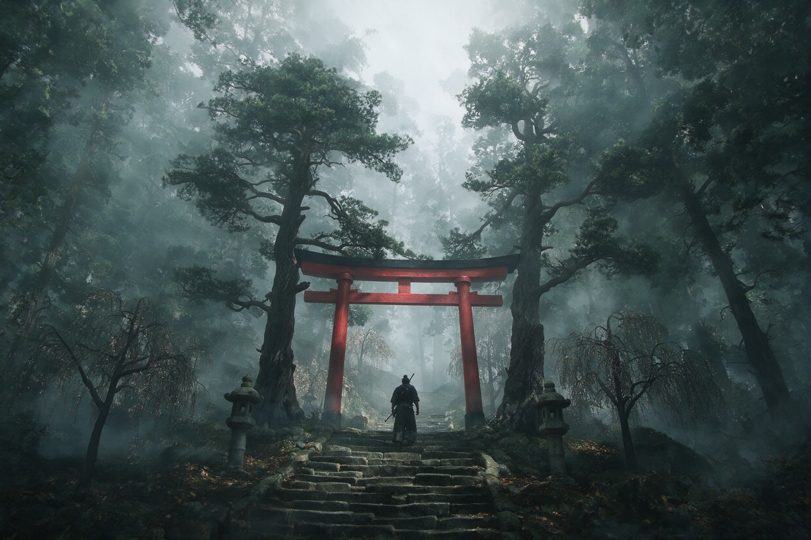
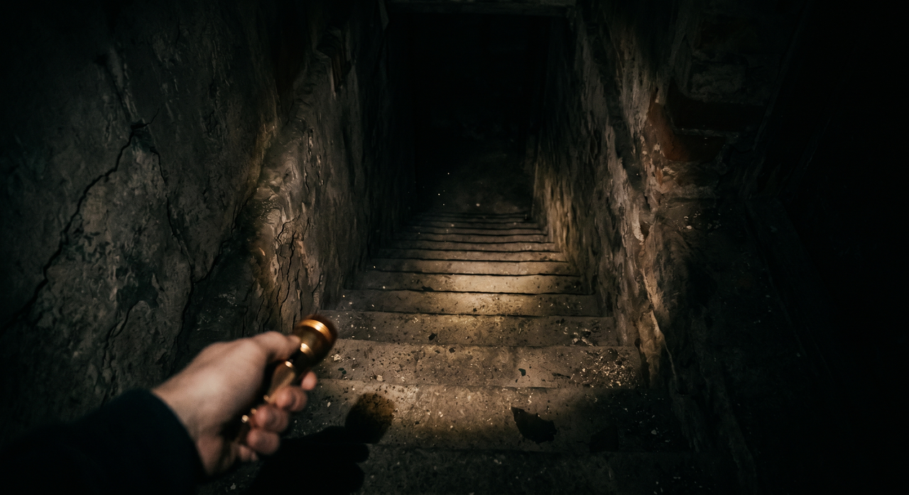
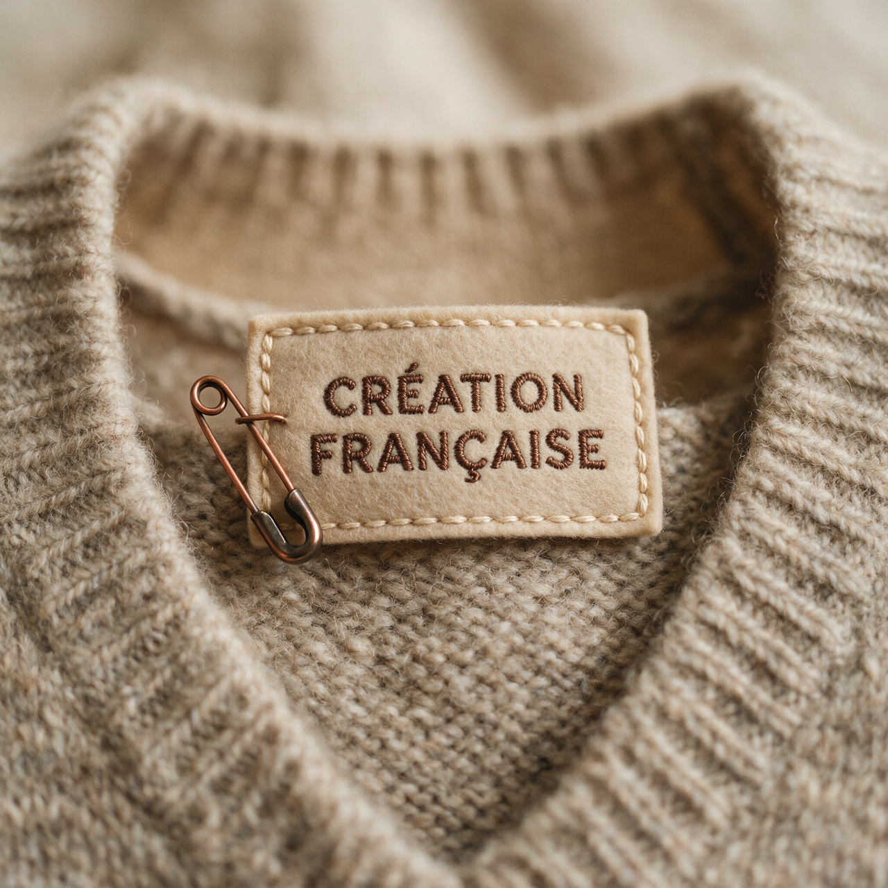

<div align="center">

<a href="https://evolink.ai/seedream-5-0-pro?utm_source=github&utm_medium=banner&utm_campaign=awesome-seedream-5-pro-guide-and-prompt&utm_content=readme_banner"></a>

# Awesome Seedream 5.0 Pro: руководство и промпты

Руководство, паттерны промптов и визуальные примеры на основе источников для оценки рабочих процессов генерации и редактирования изображений в Seedream 5.0 Pro.

[](LICENSE)
[](https://evolink.ai/seedream-5-0-pro?utm_source=github&utm_medium=badge&utm_campaign=awesome-seedream-5-pro-guide-and-prompt&utm_content=top_badge)
[](https://evolink.ai/dashboard/keys?utm_source=github&utm_medium=quickstart&utm_campaign=awesome-seedream-5-pro-guide-and-prompt&utm_content=api_key)

[🇺🇸 English](README.md) · [🇪🇸 Español](README_es.md) · [🇵🇹 Português](README_pt.md) · [🇯🇵 日本語](README_ja.md) · [🇰🇷 한국어](README_ko.md) · [🇩🇪 Deutsch](README_de.md) · [🇫🇷 Français](README_fr.md) · [🇹🇷 Türkçe](README_tr.md) · [🇹🇼 繁體中文](README_zh-TW.md) · [🇨🇳 简体中文](README_zh-CN.md) · [🇷🇺 Русский](README_ru.md)

</div>

<a id="introduction"></a>

## 🍌 Введение

В официальных запусковых материалах Seedream 5.0 Pro описан как управляемая модель для генерации и редактирования изображений. Это руководство выравнивает публичный README с официальным меню возможностей: интерактивное управление, редактирование по эскизу, редактирование слоёв, редактирование по якорям / позиции, разделение слоёв, слияние нескольких изображений, визуальные эффекты и многоязычный рендеринг текста.

**Используйте этот репозиторий, чтобы изучать примеры с подтвержденным источником, копировать только промпты из официального материала и понимать, как каждая категория связана с видимыми кейсами.**

Попробуйте входную страницу модели на EvoLink: [открыть Seedream 5.0 Pro на EvoLink](https://evolink.ai/seedream-5-0-pro?utm_source=github&utm_medium=readme&utm_campaign=awesome-seedream-5-pro-guide-and-prompt&utm_content=top_text_cta).

**Быстрый старт:** Этот репозиторий не утверждает, что первый API-запуск Seedream 5.0 Pro в EvoLink уже проверен. До появления доказательства выполнения используйте публичную страницу модели, панель API-ключей и официальную техническую справку.

1. [Открыть путь Seedream 5.0 Pro на EvoLink](https://evolink.ai/seedream-5-0-pro?utm_source=github&utm_medium=quickstart&utm_campaign=awesome-seedream-5-pro-guide-and-prompt&utm_content=model_link).
2. [Получить API-ключ EvoLink](https://evolink.ai/dashboard/keys?utm_source=github&utm_medium=quickstart&utm_campaign=awesome-seedream-5-pro-guide-and-prompt&utm_content=api_key).
3. [Прочитать официальную техническую справку ModelArk](https://docs.byteplus.com/en/docs/ModelArk/1541523).

> [!NOTE]
> Политика источников: официальный материал запуска. Приватные Lark/Feishu URL хранятся только в локальных доказательствах аудита и не публикуются как открытые страницы источников в README.

<a id="news"></a>

## 📰 Новости

- **July 8, 2026:** Первичное руководство перестроено вокруг официального меню и официально исправленного списка кейсов.

<a id="menu"></a>

## 📑 Меню

- [🍌 Введение](#introduction)
- [📰 Новости](#news)
- [📑 Меню](#menu)
- [🎛️ Интерактивное управление](#interaction-control)
  - [Case 1: Стрелки и аннотационные рамки для пространственного намерения](#case-1)
  - [Case 2: Описание объектов по областям для целевого редактирования](#case-2)
- [✏️ Редактирование по эскизу](#sketch-editing)
  - [Case 3: Генерация объекта по каракулю](#case-3)
  - [Case 4: Редактирование по цветовым блокам](#case-4)
  - [Case 5: Детальное редактирование по линиям](#case-5)
  - [Case 6: От простого эскиза к доработанному изображению](#case-6)
- [🧱 Редактирование слоёв](#layer-editing)
  - [Case 7: Редактирование текстового и графического слоя постера: Avery Turns](#case-7)
  - [Case 8: Редактирование слоя оффера в постере: Happy Hour](#case-8)
  - [Case 9: Редактирование слоя fashion-изображения внутри дизайн-макета](#case-9)
  - [Case 10: Редактирование графического слоя спортивного постера](#case-10)
  - [Case 11: Редактирование элемента постера: Public Joy](#case-11)
  - [Case 12: Замена поверхности материала с точной реакцией текстуры](#case-12)
- [📍 Редактирование по якорям / позиции](#anchor-position-editing)
  - [Case 13: Перемещение объекта по позиции в сетке](#case-13)
- [🧩 Разделение слоёв](#layer-separation)
  - [Case 14: Разделение слоя переднего плана / человека](#case-14)
- [🖼️ Редактирование слиянием нескольких изображений](#multi-image-fusion-editing)
  - [Case 15: Натюрморт из семи референсов как вход/выход](#case-15)
- [🎬 Визуальное качество и нарратив](#visual-quality-narrative)
  - [Case 16: Кинематографичная теннисная сцена с разбитым стеклом](#case-16)
  - [Case 17: Кинематографичный боксёрский экшен](#case-17)
  - [Case 18: Сцена в стиле 3D-анимации](#case-18)
  - [Case 19: Визуальный концепт-арт](#case-19)
  - [Case 20: Визуал игровой сцены](#case-20)
- [🌐 Многоязычный рендеринг текста](#multilingual-text-rendering)
  - [Case 21: Приветственный знак на арабском и английском](#case-21)
  - [Case 22: Корейский знак «открыто 24 часа»](#case-22)
  - [Case 23: Тайский знак о поддержании чистоты](#case-23)
  - [Case 24: Французский постер о творчестве](#case-24)
  - [Case 25: Русский постер о будущем](#case-25)
- [🧩 Заметки о модели](#model-notes)
- [🙏 Благодарности](#acknowledge)

<a id="interaction-control"></a>

## 🎛️ Интерактивное управление

Используйте рамки, точки, стрелки, аннотационные метки или координаты, чтобы указать целевую область.

Количество кейсов: **2**.

<a id="case-1"></a>

### Case 1: Стрелки и аннотационные рамки для пространственного намерения


> [!NOTE]
> Перед редактированием явно обозначьте целевую область стрелками, рамками и аннотациями.

---

<a id="case-2"></a>

### Case 2: Описание объектов по областям для целевого редактирования


**Prompt:**

```
Red box: A huge blue-furred head with a ferocious squished expression, gazing at the bubble ahead. Green box: A transparent bubble reflecting the indoor lights. Yellow box: A large warm gray-beige yarn ball. Blue box: A stack of building blocks including a warm dark gray arch, a warm light gray half-cylinder, a lake blue cylinder, a deep lake blue ramp, and a cobalt blue half-disc. Purple box: A grass green tasseled blanket draped over the sofa.
```

---

<a id="sketch-editing"></a>

## ✏️ Редактирование по эскизу

Используйте каракули, цветовые блоки, линии или простые эскизы как визуальные подсказки.

Количество кейсов: **4**.

<a id="case-3"></a>

### Case 3: Генерация объекта по каракулю


> [!NOTE]
> Используйте свободные каракули как визуальный управляющий сигнал, чтобы модель отрисовала нужный объект.

---

<a id="case-4"></a>

### Case 4: Редактирование по цветовым блокам


> [!NOTE]
> Используйте крупные цветовые блоки, чтобы задать общую композицию, цветовые зоны или размещение объектов.

---

<a id="case-5"></a>

### Case 5: Детальное редактирование по линиям


> [!NOTE]
> Используйте простые линии, когда граница формы важнее длинного текстового описания.

---

<a id="case-6"></a>

### Case 6: От простого эскиза к доработанному изображению


> [!NOTE]
> Превратите минимальный эскиз в более завершенное изображение, сохранив исходное намерение.

---

<a id="layer-editing"></a>

## 🧱 Редактирование слоёв

Редактируйте слои постера, графики, текста, материала или поверхности, сохраняя общую композицию.

Количество кейсов: **6**.

<a id="case-7"></a>

### Case 7: Редактирование текстового и графического слоя постера: Avery Turns



> [!NOTE]
> Редактируйте видимые элементы постера, сохраняя общую структуру дизайна.

---

<a id="case-8"></a>

### Case 8: Редактирование слоя оффера в постере: Happy Hour



> [!NOTE]
> Меняйте промо-бейдж или графический элемент, не пересобирая весь постер.

---

<a id="case-9"></a>

### Case 9: Редактирование слоя fashion-изображения внутри дизайн-макета



> [!NOTE]
> Настраивайте слоёный объект внутри собранного визуального макета.

---

<a id="case-10"></a>

### Case 10: Редактирование графического слоя спортивного постера


> [!NOTE]
> Редактируйте графику гоночного постера, сохраняя типографику и композицию выровненными.

---

<a id="case-11"></a>

### Case 11: Редактирование элемента постера: Public Joy


> [!NOTE]
> Изменяйте элементы постера, сохраняя исходный язык дизайна.

---

<a id="case-12"></a>

### Case 12: Замена поверхности материала с точной реакцией текстуры


> [!NOTE]
> Заменяйте материал и цветовые цели, сохраняя структуру объекта.

---

<a id="anchor-position-editing"></a>

## 📍 Редактирование по якорям / позиции

Используйте сеточные якоря или относительные позиции, чтобы точно переместить конкретную цель.

Количество кейсов: **1**.

<a id="case-13"></a>

### Case 13: Перемещение объекта по позиции в сетке

<table>
<tr>
<td width="50%" valign="top">

**До:**


</td>
<td width="50%" valign="top">

**После:**


</td>
</tr>
</table>

**Prompt:**

```
Move the red car in the lower-left corner one grid cell to the right, and move the black pawn in the second column from the left of the black-square position one grid cell downward.
```

---

<a id="layer-separation"></a>

## 🧩 Разделение слоёв

Разделяйте передний план, фон и повторно используемые компоненты для последующего редактирования.

Количество кейсов: **1**.

<a id="case-14"></a>

### Case 14: Разделение слоя переднего плана / человека


> [!NOTE]
> Отделяйте объект переднего плана от постерного фона для последующего повторного использования.

---

<a id="multi-image-fusion-editing"></a>

## 🖼️ Редактирование слиянием нескольких изображений

Объединяйте несколько референсных изображений в единую композицию по одной инструкции.

Количество кейсов: **1**.

<a id="case-15"></a>

### Case 15: Натюрморт из семи референсов как вход/выход

<table>
<tr>
<td width="50%" valign="top">

**Вход:**


</td>
<td width="50%" valign="top">

**Выход:**



</td>
</tr>
</table>

> [!NOTE]
> Используйте семь референсов на белом фоне как входную группу и создайте выходной натюрморт в том же парном case.


**Prompt:**

```
Precisely cut out the objects from my seven white-background reference photos and arrange them into a realistic still-life photography image according to the specified layout. Make sure the perspective, lighting, and spatial relationships are correct. Faithfully preserve material details such as wood grain, leather, lace, jelly glass, and feathers, creating a high-quality image that feels realistic and playful, with a blend of vintage and modern aesthetics.
```

---

<a id="visual-quality-narrative"></a>

## 🎬 Визуальное качество и нарратив

Группируйте примеры эффектов по кинематографичному экшену, 3D / анимации, концепт-арту и игровым сценам.

Количество кейсов: **5**.

<a id="case-16"></a>

### Case 16: Кинематографичная теннисная сцена с разбитым стеклом


> [!NOTE]
> Генерация динамичной сцены с осколками стекла, таймингом действия и кинематографичным светом.

---

<a id="case-17"></a>

### Case 17: Кинематографичный боксёрский экшен


> [!NOTE]
> Рендер экшен-сцены с более сильным ощущением движения, удара и глубины.

---

<a id="case-18"></a>

### Case 18: Сцена в стиле 3D-анимации


> [!NOTE]
> Стилизованный 3D / анимационный вывод для персонажей или развлекательных визуалов.

---

<a id="case-19"></a>

### Case 19: Визуальный концепт-арт



> [!NOTE]
> Генерация в стиле концепт-арта для исследования атмосферы, визуального направления и настроения.

---

<a id="case-20"></a>

### Case 20: Визуал игровой сцены



> [!NOTE]
> Генерация игровой сцены для исследования окружения, сета или key art.

---

<a id="multilingual-text-rendering"></a>

## 🌐 Многоязычный рендеринг текста

Группируйте многоязычные примеры по языку рендеринга и локальному текстовому сценарию.

Количество кейсов: **5**.

<a id="case-21"></a>

### Case 21: Приветственный знак на арабском и английском


> [!NOTE]
> Нативный многоязычный рендеринг с арабским и английским текстом в одном визуале.

---

<a id="case-22"></a>

### Case 22: Корейский знак «открыто 24 часа»


> [!NOTE]
> Рендеринг корейского текста для локализованных витрин или вывесок.

---

<a id="case-23"></a>

### Case 23: Тайский знак о поддержании чистоты


> [!NOTE]
> Рендеринг тайского текста для локальных общественных пространств или кампаний.

---

<a id="case-24"></a>

### Case 24: Французский постер о творчестве



> [!NOTE]
> Рендеринг французского текста для продуктовых, fashion- и кампейн-материалов.

---

<a id="case-25"></a>

### Case 25: Русский постер о будущем


> [!NOTE]
> Рендеринг русского текста с чёткой структурой символов для локализованных визуальных концепций.

---

<a id="model-notes"></a>

## 🧩 Заметки о модели

| Раздел | Заметка на основе источника |
|---|---|
| ID модели | В официальном материале указан `dola-seedream-5-0-pro-260628`; перед тем как считать это evidence первого запуска, всё ещё нужна runtime-проверка EvoLink. |
| Входные изображения | Официальный материал указывает, что Seedream 5.0 Pro поддерживает до 10 входных изображений. |
| Разрешение вывода | Не заявляйте 4K для Pro; исходный материал описывает уровни вывода около `<= 2.36M` пикселей и `> 2.36M` пикселей. |
| Нативные языки prompt | Официальный материал перечисляет арабский, английский, русский, индонезийский, испанский, немецкий, турецкий, португальский, малайский, вьетнамский, французский, японский, корейский, тагальский и тайский. |
| Путь Seedream к Seedance | Официальный материал указывает, что outputs Seedream 5.0 Pro/Lite могут быть доверенными inputs для workflows image-to-video семейства Seedance при соблюдении условий аккаунта и модерации. |

<a id="acknowledge"></a>

## 🙏 Благодарности

Этот репозиторий создан на основе официального материала запуска Seedream 5.0 Pro, экспортированного 8 июля 2026 года, и официальных исправлений списка кейсов.

- Официальные приватные URL источников сохраняются только в локальных доказательствах аудита.
- Блоки prompt включаются только там, где официальный материал предоставляет текст prompt.
- Кейсы только с медиа остаются кейсами только с медиа; отсутствующие промпты не придумываются.

*Если границу публичного case нужно исправить, откройте issue или отправьте patch с конкретной source evidence.*
